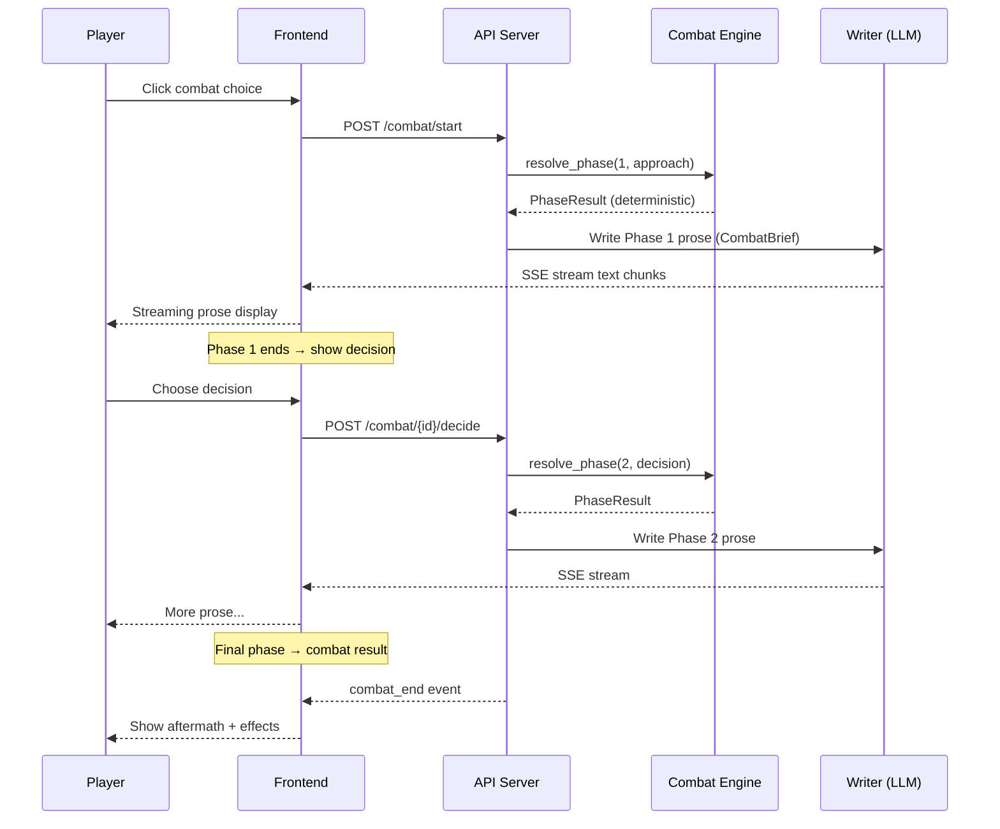

# ⚔️ CINEMATIC COMBAT — Phase-by-Phase Storytelling Spec v1.0

> **Author:** Amo  
> **Date:** 2026-02-24  
> **Status:** Draft  
> **Dependencies:** COMBAT_SYSTEM_SPEC v1.1, POWER_SYSTEM_SPEC, GDD v1.0  
> **Supersedes:** N/A — **extends** COMBAT_SYSTEM_SPEC with cinematic storytelling layer

---

## 1. Vision

> Combat không phải text wall. Combat là **phim hành động mà bạn đạo diễn.**

Mỗi combat encounter = 1 cinematic sequence gồm nhiều **phases**, mỗi phase có nhịp đập riêng. Player không spam click — player **đọc, cảm nhận, quyết định** ở các decision points tự nhiên trong narrative flow.

**Core tension:**

```
Engine tính toán deterministic → Writer kể chuyện cinematic
Player thấy KẾT QUẢ qua prose, KHÔNG qua số
```

---

## 2. Cinematic Phase Structure

### 2.1 Phase Blueprint

Mỗi combat phase là 1 **beat phim**, có cấu trúc 3 nhịp:

```
┌─────────────────────────────────────────────┐
│  TENSION BUILD                              │
│  - Establish environment + opponent state   │
│  - Foreshadow danger (boss tell)            │
│  ~80-120 từ, tone: ominous, building        │
├─────────────────────────────────────────────┤
│  EXCHANGE                                   │
│  - Combat action unfolds                    │
│  - Principle interaction described          │
│  - Player hành động → kết quả              │
│  ~150-250 từ, tone: kinetic, visceral       │
├─────────────────────────────────────────────┤
│  AFTERMATH + DECISION HOOK                  │
│  - Consequence of exchange                  │
│  - Boss shift / pattern change              │
│  - Set up the decision moment               │
│  ~60-100 từ, tone: tense, anticipation      │
└─────────────────────────────────────────────┘
```

### 2.2 Encounter Pacing — Số Phase theo Encounter Type

| Type | Phases | Words | Decision Points | Chapters | Feel |
|------|--------|-------|-----------------|----------|------|
| **Skirmish** | 1 | 200-300 | 0 | Inline | Swift, effortless |
| **Duel** | 2 | 500-700 | 1 | 1 | Tense, personal |
| **Boss** | 3 | 800-1200 | 2 | 1-2 | Epic, escalating |
| **Climax** | 4 | 1200-1800 | 3 | 2 | Cinematic, legendary |

### 2.3 Phase Tone Progression

Mỗi encounter escalate qua các tone khác nhau:

```
Phase 1 — 📘 PROBING
  Tone: Calculated, observational
  Player đang đọc enemy. Prose chậm, mô tả chi tiết.
  "Hắn di chuyển như không khí — không có bước chân,
   chỉ có sự thay đổi vị trí."

Phase 2 — 🟠 PRESSURE 
  Tone: Urgent, visceral
  Tốc độ tăng. Câu ngắn hơn. Rhythm nhanh.
  "Đòn đầu tiên. Không né. Entropy xé qua —
   và lần đầu hắn bước lùi."

Phase 3 — 🔴 REALITY BREAK
  Tone: Explosive, overwhelming
  Mô tả vượt quá vật lý — principle interaction xé giãn
  thực tại. Prose cao trào, câu fragment.
  "Không gian nứt. Ánh sáng — không, THỰC TẠI —
   đang bong ra từng mảnh."

Phase 4 — ⚫ CLIMAX / AFTERMATH
  Tone: Resolution — either triumph hoặc devastation
  Prose chậm lại. Mỗi từ có trọng lượng.
  "Và rồi — im lặng. Loại im lặng nặng đến mức
   bạn cảm nhận được nó đè lên ngực."
```

---

## 3. Writer Protocol — Cinematic Combat Prompts

### 3.1 Phase Prompt Template

Writer (LLM) nhận CombatBrief + phase-specific prompt:

```python
COMBAT_PHASE_PROMPT = """
## COMBAT SCENE — Phase {phase_number}/{total_phases}

### Context
- Enemy: {enemy_name} ({enemy_type})
- Location: {location_name}
- Enemy dominant principle: {enemy_principle}
- Player skill: {skill_name} ({skill_principle})

### Phase Outcome (Engine đã tính, KHÔNG được thay đổi)
- Outcome: {outcome}  # favorable | mixed | unfavorable
- Structural damage dealt: {structural_damage}
- Stability damage dealt: {stability_damage}
- Player stability: {player_stability}%
- Enemy stability: {enemy_stability}%
- Backlash: {backlash}
- Phase shifted: {phase_shifted}

### Boss Tell (cho phase tiếp theo)
{boss_tell}

### Narrative Cues
{narrative_cues}

---

## WRITING RULES — Phase {phase_number}

1. **STRUCTURE:** Follow the 3-beat structure:
   - TENSION BUILD (~{tension_words} từ): Set the scene, hint danger
   - EXCHANGE (~{exchange_words} từ): Combat action & consequences
   - AFTERMATH (~{aftermath_words} từ): Result + hook for next

2. **TONE:** {phase_tone}

3. **PRINCIPLE AS METAPHOR:** 
   - KHÔNG viết "Entropy attack deals 25 damage"
   - PHẢI viết "Entropy xé qua lớp cấu trúc Order — vết nứt lan
     như mạng nhện trên kính"
   - Mỗi principle có visual language riêng (xem §3.2)

4. **COMBAT OUTCOME IN PROSE:**
   - favorable → Player in control, enemy reacts
   - mixed → Mutual damage, tension balanced
   - unfavorable → Player struggling, desperation

5. **PACING RULES:**
   - Phase 1: Câu trung bình (15-20 từ). Mô tả chi tiết.
   - Phase 2: Câu ngắn hơn (8-15 từ). Rhythm nhanh.  
   - Phase 3+: Fragment sentences OK. Raw emotion.
   - BOSS TELL phải tự nhiên trong prose, KHÔNG lộ liễu

6. **STABILITY AS REALITY METAPHOR:**
   - High stability → thế giới rõ nét, mọi thứ chắc chắn
   - Low stability → thế giới méo mó, gravity lệch, ánh sáng sai
   - Stability Break → reality itself fractures

7. **COMBAT = REVELATION:**
   - Qua combat, player HIỂU enemy (motivation, không chỉ pattern)
   - Boss nói/phản ứng tiết lộ worldbuilding
   - Combat là narrative beat, KHÔNG phải filler

{decision_point_instruction}
"""
```

### 3.2 Principle Visual Language

Mỗi principle có **visual vocabulary** riêng cho Writer:

| Principle | Combat Visual | Sound | Feel |
|-----------|--------------|-------|------|
| **Matter** | Đá vỡ, kim loại biến hình, trọng lực ép | Rạn nứt, ầm ầm | Nặng, solid, unstoppable |
| **Energy** | Tia sáng, plasma, nhiệt độ cực đoan | Rít, nổ, ù tai | Nóng, rực, blinding |
| **Entropy** | Phân rã, rỉ sét tức thì, cấu trúc tan | Xì, lách tách | Mục nát, chậm rãi, inevitable |
| **Flux** | Phase-shift, nhấp nháy, teleport | Ù không gian, méo | Unstable, disorienting |
| **Void** | Hư vô, nuốt chửng, triệt tiêu | Im lặng | Trống rỗng, absolute |
| **Order** | Ánh sáng vàng, luật cứng, chain/bind | Tiếng chuông, rung | Cứng nhắc, inflexible |
| **Chaos** | Biến hình ngẫu nhiên, mutation | Tiếng xé, biến dạng | Wild, unpredictable |

### 3.3 Decision Point Rendering

Decision points được embed TRONG prose, không phải UI riêng:

```markdown
[COMBAT PROSE KẾT THÚC PHASE]

Dây xích ánh sáng bắt đầu quấn quanh không gian. 
Phase 2 — Contract Bind — sắp kích hoạt.

Bạn cảm nhận được: còn đúng 1 khoảnh khắc trước khi 
mọi thứ thay đổi.

---

**⚔️ Quyết định chiến đấu:**

🔥 **Bùng nổ Entropy Shred — kết thúc ngay**
_Dồn toàn lực trước khi dây xích khóa. Nếu thành công, 
chiến đấu kết thúc. Nếu thất bại — backlash._
`[Overdrive — Rủi ro: ●●●●●]`

🔄 **Chuyển vector, né khế ước**
_Từ bỏ tấn công, tập trung né dây xích. Chuẩn bị 
counter Phase 2._
`[Shift — Rủi ro: ●●○○○]`

🛡️ **Ổn định bản thân**
_Chấp nhận bị bind. Stability đầy để chịu đựng và 
tìm khe hở từ bên trong._
`[Stabilize — Rủi ro: ●○○○○]`
```

### 3.4 Decision Point Context Quality

Writer phải đảm bảo 3 choices KHÁC BIỆT RÕ RÀNG:

| Choice Pattern | Strategy | Risk | Suitable When |
|---------------|----------|------|---------------|
| **All-in** | End it now, accept total risk | ●●●●● | High resonance, need quick finish |
| **Adaptive** | Counter enemy's next move | ●●●○○ | Read boss tell correctly |
| **Conservative** | Survive, gain info, prepare | ●○○○○ | Low stability, need recovery |

> **Không bao giờ có choice "đúng tuyệt đối."** Mỗi choice có trade-off dựa trên current state.

---

## 4. Streaming Combat — Phased Delivery

### 4.1 Why Streaming?

Combat prose dài (500-1800 từ). Không thể đợi Writer viết hết rồi hiển thị. **Streaming per-phase** tạo cinematic feel:

```
Phase 1 prose streams → [ngừng] → loading animation
  → Decision Point hiện lên (nếu có)
  → Player chọn
Phase 2 prose streams → [ngừng] → loading animation  
  → Decision Point hiện lên (nếu có)
  → Player chọn
Phase 3 prose streams → combat kết thúc
```

### 4.2 API Design — Combat SSE Stream

```
POST /api/combat/start
  Request:  { scene_id, player_approach: { action, intensity } }
  Response: { combat_id, stream_url }

GET /api/combat/{combat_id}/stream   (SSE)
  Events:
    phase_start      { phase: 1, total: 3, tone: "probing" }
    text_chunk       { delta: "Hắn di chuyển..." }
    text_chunk       { delta: "như không khí —" }
    ...
    phase_end        { phase: 1 }
    decision_point   { choices: [...], context: "..." }
    
  [Player chooses via POST /api/combat/{combat_id}/decide]
  
    phase_start      { phase: 2, tone: "pressure" }
    text_chunk       { delta: "Đòn đầu tiên..." }
    ...
    phase_end        { phase: 2 }
    decision_point   { choices: [...] }
    
  [Player chooses]
    
    phase_start      { phase: 3, tone: "climax" }
    ...
    combat_end       { outcome: "favorable", effects: {...} }
```

### 4.3 Frontend Combat View

```
┌─────────────────────────────────────┐
│  ⚔️ TRẤN GIỚI HỘ PHÁP             │
│  Phase 2/3 — Distortion            │
│  ▰▰▰▰▰▰▰▱▱▱ 70%                   │
├─────────────────────────────────────┤
│                                     │
│  [Streaming prose text here]        │
│  Entropy xé qua lớp cấu trúc       │
│  Order — vết nứt lan như mạng       │
│  nhện trên kính...                  │
│                                     │
│  ▍ ← cursor (đang stream)          │
│                                     │
├─────────────────────────────────────┤
│  HP ▰▰▰▰▰▰▰▱▱▱ 72%               │
│  Stability ▰▰▰▰▰▰▱▱▱▱ 58%        │
└─────────────────────────────────────┘
```

Sau khi phase kết thúc, nếu có decision point:

```
┌─────────────────────────────────────┐
│  ⚔️ QUYẾT ĐỊNH CHIẾN ĐẦU          │
│                                     │
│  "Dây xích ánh sáng bắt đầu       │
│   hình thành quanh không gian..."   │
│                                     │
│  ┌─────────────────────────────┐   │
│  │ 🔥 Bùng nổ Entropy Shred   │   │
│  │ Rủi ro: ●●●●●              │   │
│  └─────────────────────────────┘   │
│  ┌─────────────────────────────┐   │
│  │ 🔄 Chuyển vector            │   │
│  │ Rủi ro: ●●○○○              │   │
│  └─────────────────────────────┘   │
│  ┌─────────────────────────────┐   │
│  │ 🛡️ Ổn định bản thân        │   │
│  │ Rủi ro: ●○○○○              │   │
│  └─────────────────────────────┘   │
└─────────────────────────────────────┘
```

---

## 5. Combat Engine Integration

### 5.1 Flow — Cinematic Combat Pipeline



### 5.2 CombatBrief Enhancement

Thêm cinematic fields vào CombatBrief (extends COMBAT_SYSTEM_SPEC §7):

```python
class CinematicCombatBrief(CombatBrief):
    """Extended combat brief with cinematic storytelling data."""
    
    # Phase-specific writer guidance
    phase_tone: str = "probing"          # probing | pressure | climax | aftermath
    tension_words: int = 100             # target word count for tension build
    exchange_words: int = 200            # target word count for exchange
    aftermath_words: int = 80            # target word count for aftermath
    
    # Visual language hints
    player_principle_visuals: list[str] = []   # ["entropy: phân rã, rỉ sét"]
    enemy_principle_visuals: list[str] = []    # ["order: ánh sáng vàng, chain"]
    
    # Environment mood
    environment_description: str = ""     # "Đền thờ cổ, ánh sáng xuyên khe nứt"
    environment_combat_modifier: str = "" # "Order +20%, cấu trúc đá cổ cộng hưởng"
    
    # Streaming control
    stream_phase_by_phase: bool = True    # enable per-phase streaming
    pause_after_phase: bool = True        # pause for decision point
```

### 5.3 Multi-Chapter Boss Fights

Boss fights can span multiple chapters:

```
Chapter N:
├── Narrative context (300-400 từ)  
├── Combat Phase 1 — stream prose
├── Decision Point 1 → choice cuối chapter
└── Chapter ends

Chapter N+1:
├── Quick recap (50 từ)
├── Combat Phase 2 — stream prose (based on previous choice)
├── Decision Point 2 → choice giữa chapter
├── Combat Phase 3 — stream prose (climax)
├── Combat aftermath
└── Narrative consequences
```

---

## 6. Unique Skill Cinematic Moments

### 6.1 Skill Activation — Cinematic Overlay

Khi unique skill activates trong combat, prose có **đặc biệt treatment:**

```
[Prose bình thường đang stream]

Hộ Pháp bước tới, dây xích ánh sáng quấn chặt —
và bạn cảm nhận thứ gì đó KHÁC.

  ✦ ───── UNIQUE SKILL ACTIVATION ───── ✦

  「PHÂN GIẢI TẤT CẢ」

  Bạn không tấn công. Bạn HIỂU.
  Cấu trúc Order — không phải bền vững.
  Nó là luật. Và mọi luật đều có kẽ hở.

  Entropy không phá hủy. Entropy TÌM RA kẽ hở.

  ✦ ────────────────────────────────── ✦

Dây xích dừng lại giữa không trung, run rẩy. 
Rồi — tan. Từng sợi, từng sợi, như cát trong gió.
```

### 6.2 Overdrive Cinematic

Overdrive là moment cao trào nhất:

```
[Decision: Player chọn Overdrive Strike]

  ⚡ ───── OVERDRIVE ───── ⚡

  Mọi thứ chậm lại.

  Bạn cảm nhận ranh giới — đường biên
  giữa sức mạnh bạn KIỂM SOÁT được
  và sức mạnh sẽ NUỐT CHỬNG bạn.

  Bạn bước qua.

  ⚡ ──────────────────── ⚡

[Kết quả: favorable → epic finish]
[Kết quả: backlash → devastating cost]
```

### 6.3 Stability Break — Reality Fracture

Khi stability < 10%:

```
Thế giới... sai.

Trọng lực kéo sang trái. Ánh sáng có mùi. 
Bạn nghe thấy MÀU SẮC.

  ⊘ ── STABILITY BREAK ── ⊘

  Thực tại đang vỡ. Xung quanh bạn,
  không gian co giật như phim bị lỗi.

  Mỗi kỹ năng bạn dùng từ giờ có thể
  misfire — hoặc biến thành thứ gì đó
  bạn không lường trước.

  ⊘ ──────────────────── ⊘
```

---

## 7. Environmental Storytelling in Combat

### 7.1 Location ảnh hưởng Combat Prose

Combat không xảy ra trong chân không. Environment là **character thứ 3:**

| Location Type | Prose Style | Combat Feel |
|--------------|------------|-------------|
| Grand Gate city | Structured, orderly | "Mọi đòn đánh đều echo qua hành lang đá" |
| Wild zone | Chaotic, primal | "Cây cối biến hình, mặt đất nhào lên" |
| Tower floor | Claustrophobic, intense | "Tường ép lại. Không có chỗ chạy." |
| Void rift | Surreal, disorienting | "Trọng lực đảo chiều giữa chừng." |
| Ritual site | Sacred, heavy consequence | "Không khí nặng đến mức khó thở." |

### 7.2 Environment Interaction in Prose

Writer phải weave environment vào combat:

```diff
- "Player tấn công bằng Entropy Shred."
+ "Entropy Shred xé qua không khí — và các cột đá cổ trong đền 
+  bắt đầu rạn nứt theo, như thể sức mạnh đang CỘNG HƯỞNG 
+  với sự mục nát đã tích tụ hàng thế kỷ."
```

---

## 8. Post-Combat Cinematic

### 8.1 Victory Aftermath

```
[Combat kết thúc — favorable]

Hộ Pháp quỳ xuống. Ánh sáng vàng trong mắt hắn 
nhạt dần, nhưng không tắt hẳn.

"Ngươi... không giống những kẻ trước."

Hắn không nói thêm. Cánh cổng phía sau hắn rung lên, 
rồi mở ra — ánh sáng tràn qua khe hở như nước.

  ✦ Resonance +0.03 (Entropy)
  ✦ Floor progress: Tầng 2 mở khóa
  ✦ DQS +2 (đọc đúng boss pattern)
```

### 8.2 Defeat / Fate Buffer Save

```
[Combat kết thúc — unfavorable + Fate Buffer triggered]

Bạn ngã. Không phải từ từ — mà như bị
trọng lực nhân lên gấp mười.

Tầm nhìn tối dần. Nhưng ngay khoảnh khắc
mọi thứ sắp kết thúc —

  ✧ ── FATE BUFFER — WORLD'S FIRST MERCY ── ✧

  Thế giới không muốn bạn chết. Chưa.
  
  Một lực — không phải từ bạn, không phải từ skill —
  kéo bạn ra khỏi bờ vực. Lần này không mất gì.
  Nhưng bạn cảm nhận: còn 2 lần nữa.
  Sau đó, thế giới sẽ ngừng cứu.

  ✧ ──────────────────────────────────── ✧

  ⚠ Fate Buffer: 3/4 → 2/4
  ⚠ Defeat count: 0 → 1
  ⚠ Scar gained: [HP penalty -5% max]
```

---

## 9. Cinematic Combat Configuration

### 9.1 Writer Config per Encounter Type

```python
CINEMATIC_CONFIG = {
    "skirmish": {
        "phases": 1,
        "total_words": (200, 300),
        "phase_tones": ["probing"],
        "decision_points": 0,
        "stream": False,           # Too short to stream
        "inline": True,            # Part of chapter prose
    },
    "duel": {
        "phases": 2,
        "total_words": (500, 700),
        "phase_tones": ["probing", "climax"],
        "decision_points": 1,
        "stream": True,
        "inline": False,           # Separate combat view
    },
    "boss": {
        "phases": 3,
        "total_words": (800, 1200),
        "phase_tones": ["probing", "pressure", "climax"],
        "decision_points": 2,
        "stream": True,
        "inline": False,
    },
    "climax": {
        "phases": 4,
        "total_words": (1200, 1800),
        "phase_tones": ["probing", "pressure", "reality_break", "climax"],
        "decision_points": 3,
        "stream": True,
        "inline": False,
    },
}
```

### 9.2 LLM Cost Estimation

| Type | LLM Calls | Est. Cost | Latency |
|------|-----------|-----------|---------|
| Skirmish | 1 (inline in chapter) | ~$0.001 | 3-5s |
| Duel | 2 (phase 1 + phase 2) | ~$0.002 | 8-12s |
| Boss | 3 (per phase) | ~$0.003 | 15-20s |
| Climax | 4 (per phase) | ~$0.004 | 20-30s |

> **Budget:** Worst case boss fight = 3 LLM calls × $0.001 = $0.003. Acceptable.

---

## 10. Implementation Phases

### Phase A — Foundation (MVP)

| Component | Detail |
|-----------|--------|
| `CinematicCombatBrief` model | Extend CombatBrief with phase tones, visual hints |
| Combat Writer prompt | Template for phase-by-phase prose generation |
| Phase tone system | Map tone strings to word counts + style rules |
| Skirmish (inline) | Combat prose embedded in chapter (no decision point) |
| Duel (1 DP) | 2-phase, 1 decision point, basic streaming |

### Phase B — Full Cinematic

| Component | Detail |
|-----------|--------|
| SSE streaming endpoint | Per-phase streaming combat prose |
| Combat frontend view | Dedicated combat UI with HP/Stability bars |
| Boss fight (2 DP) | 3-phase full cinematic flow |
| Unique skill activation overlay | Special prose treatment for skill use |
| Environmental combat prose | Location-aware combat descriptions |

### Phase C — Polish

| Component | Detail |
|-----------|--------|
| Climax (3 DP) | 4-phase season boss cinematic |
| Multi-chapter boss | Boss fight spanning 2 chapters |
| Overdrive cinematic | Special prose for Overdrive moments |
| Stability Break effects | Reality-warping prose at low stability |
| Post-combat aftermath | Victory/defeat cinematic sequences |

---

## 11. Relationship to Existing Specs

| Spec | Relationship |
|------|-------------|
| **COMBAT_SYSTEM_SPEC** | This spec EXTENDS §7 (CombatBrief) with cinematic storytelling layer. Engine math unchanged. |
| **POWER_SYSTEM_SPEC** | Principle visual language (§3.2) draws from power system definitions |
| **PROGRESSION_SYSTEM_SPEC** | Combat progression hooks (DQS, resonance growth) unchanged |
| **SOUL_FORGE_SPEC** | Unique skill activation cinematic (§6) uses skill data from Soul Forge |
| **UNIQUE_SKILL_GROWTH_SPEC** | Skill evolution moments can trigger in-combat cinematic (§6.1) |

---

## 12. Safety Constraints

| Rule | Reason |
|------|--------|
| Engine outcome TRƯỚC Writer prose | Deterministic core preserved |
| Writer KHÔNG quyết định damage/outcome | Consistency |
| Phase word count enforced (±20%) | Prevent text walls |
| Max 4 phases per encounter | Prevent fatigue |
| Decision timeout: 5 min | Prevent abandoned combats |
| Streaming heartbeat: 500ms | Detect disconnects |
| Fallback: if Writer fails → static prose | Always playable |

---

## Appendix A: Example Full Boss Fight

### Setup
- **Boss:** Trấn Giới Hộ Pháp (Order)
- **Player:** Entropy Shred build, Resonance 0.68
- **Floor:** Temple (Order +20%)

### Phase 1 — Probing (~300 từ)

> Hắn không di chuyển. Hắn ĐỨNG ĐÓ — và bạn hiểu ngay vì sao hắn là Hộ Pháp.
>
> Ánh sáng vàng bao phủ cơ thể hắn như bộ giáp thứ hai. Không phải ma thuật — đây là ORDER ở dạng thuần khiết nhất. Cấu trúc. Quy luật. Hắn LÀ luật.
>
> Bạn mở Entropy Shred — dòng phân rã chảy dọc cánh tay — và lần đầu tiên, bạn cảm nhận SỰ KHÁNG CỰ. Entropy thường ăn mòn mọi thứ. Nhưng Order của hắn... không nhượng bộ.
>
> Đòn đầu tiên của bạn rạch qua ánh sáng vàng. Vết nứt nhỏ xuất hiện — rồi tự lành trong tích tắc.
>
> Hắn nhìn bạn. Không giận. Không tò mò. Chỉ... đánh giá.
>
> "Entropy." Giọng hắn phẳng lặng. "Lâu rồi không ai mang principle đó tới đây."
>
> Từ phía sau, bạn nhận ra: **dây xích ánh sáng bắt đầu hình thành** quanh biên giới chiến trường.

### Decision Point 1

> **⚔️ Quyết định chiến đấu:**
>
> 🔥 **Dồn toàn lực Entropy — phá vỡ trước khi hắn bind**
> `[Overdrive Strike — Rủi ro: ●●●●●]`
>
> 🔄 **Chuyển vector, chuẩn bị counter dây xích**
> `[Shift — Rủi ro: ●●○○○]`
>
> 🛡️ **Ổn định, chấp nhận bị bind**
> `[Stabilize — Rủi ro: ●○○○○]`

### Phase 2 — Pressure (~400 từ, nếu chọn Shift)

> Bạn không tấn công. Bạn THAY ĐỔI.
>
> Entropy Shred biến từ dòng phân rã thành... sương mù. Nhẹ. Lan tỏa. Không phá hủy — chỉ ĂN MÒN từ từ.
>
> Dây xích ánh sáng quấn quanh bạn — NHƯNG mỗi nơi chúng chạm vào sương mù, Order BỊ MÀI MÒN. Chậm. Nhưng chắc chắn.
>
> [...]
>
> Hộ Pháp sững lại. Lần đầu tiên, ánh sáng trong mắt hắn nhấp nháy.
>
> **Stability hắn: 58%.**

### Phase 3 — Climax (~300 từ)

> [Prose cao trào — resolution dựa trên toàn bộ combat state]

---

## Appendix B: Glossary

| Term | Definition |
|------|-----------|
| **Phase** | Một beat phim trong combat, có tone + word budget riêng |
| **Decision Point** | Khoảnh khắc player chọn action/intensity |
| **Boss Tell** | Dấu hiệu trong prose báo boss sắp chuyển phase |
| **Stability Break** | Stability < 10%, reality warps |
| **Cinematic Overlay** | Special prose treatment (unique skill, overdrive) |
| **Inline Combat** | Skirmish embedded trong chapter prose |
| **Streamed Combat** | Phase-by-phase prose delivery via SSE |
