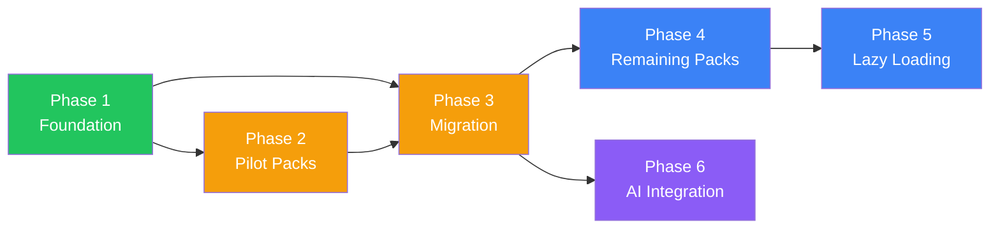

# Amo Lofi — Scene Icon System Spec

## Tổng Quan

Hệ thống SVG icon riêng cho từng scene, tự động thay đổi khi chuyển chủ đề.
Hỗ trợ lazy loading, fallback, và AI-generated icon packs cho workspace tương lai.

**Hiện trạng**: Tất cả components dùng `lucide-react` generic icons.
**Mục tiêu**: Mỗi scene có bộ icon riêng phản ánh aesthetic/mood của scene đó.

---

## Phase 1 — Foundation (Kiến Trúc Core)

### Mục tiêu
Dựng toàn bộ infrastructure: interfaces, registry, hook, default fallback pack.
Không thay đổi UI visible — chỉ setup plumbing.

### Files

#### 1.1 — `src/icons/types.ts` [NEW]

```typescript
import type { CSSProperties, FC } from 'react';

export interface IconProps {
    size?: number;
    color?: string;
    className?: string;
    style?: CSSProperties;
}

/**
 * Full icon pack cho 1 scene.
 * Mỗi scene có thể override toàn bộ hoặc một phần icon.
 * Icon thiếu sẽ fallback về defaultPack.
 */
export interface SceneIconPack {
    id: string;

    /** UI control icons — sidebar, player, toolbar */
    ui: {
        music: FC<IconProps>;        // Sidebar: Sound Mixer toggle
        scenes: FC<IconProps>;       // Sidebar: Scene selector toggle
        focus: FC<IconProps>;        // Sidebar: Focus panel toggle
        play: FC<IconProps>;         // Player: Play
        pause: FC<IconProps>;        // Player: Pause
        skipNext: FC<IconProps>;     // Player: Next track
        skipPrev: FC<IconProps>;     // Player: Previous track
        volumeHigh: FC<IconProps>;   // Player: Volume high
        volumeLow: FC<IconProps>;    // Player: Volume low
        volumeMute: FC<IconProps>;   // Player: Volume muted
        sun: FC<IconProps>;          // Sidebar: Day mode
        moon: FC<IconProps>;         // Sidebar: Night mode
        zen: FC<IconProps>;          // Sidebar: Zen mode
        fullscreen: FC<IconProps>;   // Sidebar: Fullscreen
        close: FC<IconProps>;        // Panel: Close button
        check: FC<IconProps>;        // Scene: Active indicator
        timer: FC<IconProps>;        // Focus: Pomodoro timer
        tasks: FC<IconProps>;        // Focus: Task list
        stats: FC<IconProps>;        // Focus: Statistics
        add: FC<IconProps>;          // Focus: Add task
        trash: FC<IconProps>;        // Focus: Delete task
    };

    /** Ambience sound icons — mapped by sound ID */
    ambience: {
        rain: FC<IconProps>;
        thunder: FC<IconProps>;
        wind: FC<IconProps>;
        fire: FC<IconProps>;
        coffee_shop: FC<IconProps>;
        ocean: FC<IconProps>;
        white_noise: FC<IconProps>;
    };

    /** Genre icons — mapped by genre ID */
    genre: {
        lofi: FC<IconProps>;
        synthwave: FC<IconProps>;
        classical: FC<IconProps>;
        ambient: FC<IconProps>;
    };
}
```

**Tổng: 32 icons per pack**
- 21 UI icons
- 7 Ambience icons  
- 4 Genre icons

---

#### 1.2 — `src/icons/packs/defaultPack.ts` [NEW]

Wrap `lucide-react` icons → conform `SceneIconPack` interface.
Đây là fallback — nếu scene chưa có custom pack, dùng pack này.

```typescript
import {
    Music, Palette, Timer, Play, Pause, SkipBack, SkipForward,
    Volume2, Volume1, VolumeX, Sun, Moon, Eye, Maximize,
    X, Check, Clock, ListTodo, BarChart3, Plus, Trash2,
    CloudRain, CloudLightning, Wind, Flame, Coffee, Waves, Radio,
    Piano, Guitar, Music2, Sparkles,
} from 'lucide-react';
import type { SceneIconPack } from '../types';

// Mỗi lucide icon đã conform (size, color) → chỉ cần map
export const defaultPack: SceneIconPack = {
    id: 'default',
    ui: {
        music: Music,
        scenes: Palette,
        focus: Timer,
        play: Play,
        pause: Pause,
        skipNext: SkipForward,
        skipPrev: SkipBack,
        volumeHigh: Volume2,
        volumeLow: Volume1,
        volumeMute: VolumeX,
        sun: Sun,
        moon: Moon,
        zen: Eye,
        fullscreen: Maximize,
        close: X,
        check: Check,
        timer: Clock,
        tasks: ListTodo,
        stats: BarChart3,
        add: Plus,
        trash: Trash2,
    },
    ambience: {
        rain: CloudRain,
        thunder: CloudLightning,
        wind: Wind,
        fire: Flame,
        coffee_shop: Coffee,
        ocean: Waves,
        white_noise: Radio,
    },
    genre: {
        lofi: Piano,
        synthwave: Guitar,
        classical: Music2,
        ambient: Sparkles,
    },
};
```

---

#### 1.3 — `src/icons/index.ts` [NEW]

```typescript
import { defaultPack } from './packs/defaultPack';
import type { SceneIconPack } from './types';

export type { SceneIconPack, IconProps } from './types';

/**
 * Icon Pack Registry
 * 
 * Key = scene ID from scenes.ts
 * Value = lazy-loaded icon pack
 * 
 * Scenes không có entry ở đây → dùng defaultPack.
 * AI-generated scenes register pack tại runtime via registerIconPack().
 */
const _registry = new Map<string, SceneIconPack>();

export function registerIconPack(sceneId: string, pack: SceneIconPack) {
    _registry.set(sceneId, pack);
}

export function getIconPack(sceneId: string): SceneIconPack {
    return _registry.get(sceneId) ?? defaultPack;
}

export { defaultPack };
```

---

#### 1.4 — `src/hooks/useSceneIcons.ts` [NEW]

```typescript
import { useMemo } from 'react';
import { useLofiStore } from '../store/useLofiStore';
import { getIconPack } from '../icons';
import type { SceneIconPack } from '../icons/types';

/**
 * useSceneIcons — returns the icon pack for the active scene.
 * 
 * Usage:
 *   const icons = useSceneIcons();
 *   <icons.ui.play size={18} color="white" />
 */
export function useSceneIcons(): SceneIconPack {
    const activeSceneId = useLofiStore((s) => s.activeSceneId);
    return useMemo(() => getIconPack(activeSceneId), [activeSceneId]);
}
```

### Kết quả Phase 1
- ✅ `SceneIconPack` interface định nghĩa rõ 32 icon slots
- ✅ `defaultPack` wrap lucide-react → không breaking change
- ✅ Registry pattern cho runtime registration (AI packs)
- ✅ `useSceneIcons()` hook sẵn sàng dùng trong components
- ✅ **UI hoàn toàn không thay đổi** — safe deploy

---

## Phase 2 — Pilot Packs (Cozy Cafe + Space Station)

### Mục tiêu
Tạo 2 bộ icon đối lập để validate design direction:
- **Cozy Cafe** → warm, rounded, organic
- **Space Station** → minimal, thin-line, geometric

### Icon Style Guide

#### Cozy Cafe (`cafePack.tsx`)

| Thuộc tính | Giá trị |
|-----------|---------|
| **Stroke width** | 1.8 - 2.0 |
| **Stroke cap** | `round` |
| **Stroke join** | `round` |
| **Corner radius** | Lớn, tròn |
| **Fill** | Occasional warm fills (steam, glow) |
| **Đặc biệt** | Steam wisps, organic curves |
| **Cảm giác** | Ấm áp, mời gọi, comfortable |

Icon đáng chú ý:
- `music` → Coffee cup với nốt nhạc bay lên
- `scenes` → Cửa sổ café với rèm cửa
- `focus` → Đồng hồ hourglass style vintage
- `play/pause` → Nút tròn mềm mại
- `fire` → Ngọn lửa ấm áp, organic shape
- `coffee_shop` → Tách cà phê bốc khói chi tiết
- `rain` → Giọt mưa tròn, mềm
- `lofi` → Piano keys tròn cạnh

#### Space Station (`spacePack.tsx`)

| Thuộc tính | Giá trị |
|-----------|---------|
| **Stroke width** | 1.2 - 1.5 |
| **Stroke cap** | `round` hoặc `square` |
| **Stroke join** | `miter` hoặc `round` |
| **Corner radius** | Nhỏ hoặc không |
| **Fill** | Hiếm khi dùng — outline only |
| **Đặc biệt** | Dots, circuits, hexagons |
| **Cảm giác** | Tương lai, sạch sẽ, tối giản |

Icon đáng chú ý:
- `music` → Waveform / signal icon
- `scenes` → Grid of hexagons / planet
- `focus` → Digital timer display
- `play/pause` → Chevron/bars phẳng, geometric
- `fire` → Reactor / energy core
- `white_noise` → Signal wave / static
- `ocean` → Sine wave pattern
- `synthwave` → Lightning bolt / electric

### Files Phase 2

```
src/icons/packs/
├── cafePack.tsx        # ~250 lines, 32 SVG components
└── spacePack.tsx       # ~250 lines, 32 SVG components
```

#### Registration (update `src/icons/index.ts`)

```typescript
import { cafePack } from './packs/cafePack';
import { spacePack } from './packs/spacePack';

// Static registration for built-in scenes
registerIconPack('cozy_cafe', cafePack);
registerIconPack('space_station', spacePack);
```

### Kết quả Phase 2
- ✅ 2 bộ icon hoàn chỉnh (64 custom SVG icons)
- ✅ Chuyển scene Cafe ↔ Space → icon thay đổi rõ ràng
- ✅ 4 scenes còn lại vẫn dùng `defaultPack` → không broken
- 🔍 **Review checkpoint**: User đánh giá style direction

---

## Phase 3 — Component Migration

### Mục tiêu
Migrate tất cả components từ `lucide-react` imports trực tiếp → `useSceneIcons()`.
Sau phase này, chuyển scene sẽ thay đổi icon trên toàn bộ UI.

### Migration Map

#### `Sidebar.tsx`

```
TRƯỚC:  import { Music, Palette, Timer, Sun, Moon, Maximize, Eye } from 'lucide-react'
SAU:    const icons = useSceneIcons()
        icons.ui.music / icons.ui.scenes / icons.ui.focus / ...
```

Thay đổi: 7 icon references

#### `SoundMixer.tsx`

```
TRƯỚC:  GENRE_ICON map + AMBIENCE_ICONS map (hardcoded lucide)
SAU:    icons.genre[track.genre] + icons.ambience[sound.id]
        + icons.ui.play/pause/skipNext/skipPrev/volumeHigh/...
```

Thay đổi: ~18 icon references. Xoá `GENRE_ICON` và `AMBIENCE_ICONS` maps.

#### `PlayerBar.tsx`

```
TRƯỚC:  import { SkipBack, Play, Pause, SkipForward, Volume2, VolumeX, Volume1 }
SAU:    icons.ui.play/pause/skipNext/skipPrev/volumeHigh/volumeLow/volumeMute
```

Thay đổi: 7 icon references

#### `FocusPanel.tsx`

```
TRƯỚC:  import { X, Timer, ListTodo, BarChart3, RotateCcw, Settings }
SAU:    icons.ui.close/timer/tasks/stats
```

Thay đổi: ~5 icon references

#### `PomodoroTimer.tsx`

```
TRƯỚC:  import { Play, Pause, SquareIcon, SkipForward, RotateCcw, Settings }
SAU:    icons.ui.play/pause/skipNext + giữ SquareIcon/RotateCcw/Settings từ lucide
```

Thay đổi: ~3 icon references (không phải tất cả đều cần themed)

#### `TaskList.tsx`

```
TRƯỚC:  import { Plus, Check, Trash2 }
SAU:    icons.ui.add/check/trash
```

Thay đổi: 3 icon references

#### `FocusStats.tsx`

```
TRƯỚC:  import { Clock, Target, Flame, TrendingUp }
SAU:    icons.ui.timer + giữ Target/TrendingUp từ lucide (không cần themed)
```

Thay đổi: 1-2 icon references

#### `SceneSelector.tsx`

```
TRƯỚC:  import { X, Check }
SAU:    icons.ui.close/check
```

Thay đổi: 2 icon references

### Nguyên tắc migration

> **Chỉ theme-ify icon có ý nghĩa visual.** Icon utility thuần túy (RotateCcw, Settings, TrendingUp)
> giữ nguyên lucide-react vì chúng là universal UI patterns, không liên quan meesthetic.

### Tổng: ~46 icon references cần migrate across 8 files

### Kết quả Phase 3
- ✅ Toàn bộ UI icons react to scene changes
- ✅ lucide-react chỉ còn cho utility icons (Settings, RotateCcw, ...)
- ✅ `useSceneIcons()` là single source cho themed icons

---

## Phase 4 — Remaining Icon Packs

### Mục tiêu
Tạo 4 bộ icon còn lại cho full coverage.

### Style Guides

#### Japanese Garden (`gardenPack.tsx`)

| Thuộc tính | Giá trị |
|-----------|---------|
| **Stroke width** | 1.5 |
| **Style** | Flowing, organic, ink-brush feel |
| **Đặc biệt** | Lá cây, sóng nước, torii gate shapes |
| **Cảm giác** | Zen, thanh tịnh, tự nhiên |

- `music` → Shakuhachi (sáo tre) / koto
- `scenes` → Torii gate mini
- `focus` → Zen garden rake pattern
- `rain` → Mưa kiểu tranh Nhật (diagonal fine lines)
- `wind` → Cành sakura bay
- `ocean` → Sóng kiểu "The Great Wave"

#### City Night (`cityPack.tsx`)

| Thuộc tính | Giá trị |
|-----------|---------|
| **Stroke width** | 1.5 |
| **Style** | Sharp, angular, neon-glow ready |
| **Đặc biệt** | Geometric shapes, circuitry, glow stripes |
| **Cảm giác** | Cyberpunk, energetic, electric |

- `music` → Equalizer bars / headphone
- `scenes` → Skyscraper silhouette grid
- `focus` → Digital clock digits
- `rain` → Diagonal rain with neon reflection
- `thunder` → Electric bolt, angular
- `synthwave` → Retro sun / grid

#### Forest Cabin (`forestPack.tsx`)

| Thuộc tính | Giá trị |
|-----------|---------|
| **Stroke width** | 1.8 - 2.2 |
| **Style** | Hand-drawn, rough, organic |
| **Đặc biệt** | Tree bark textures, leaf shapes, campfire |
| **Cảm giác** | Rustic, earthy, warm |

- `music` → Guitar acoustic / campfire guitar
- `scenes` → Pine trees / cabin silhouette  
- `focus` → Sundial / wooden hourglass
- `fire` → Campfire with logs — detailed
- `wind` → Leaves blowing
- `ocean` → Stream / river

#### Ocean Cliff (`oceanPack.tsx`)

| Thuộc tính | Giá trị |
|-----------|---------|
| **Stroke width** | 1.5 - 1.8 |
| **Style** | Fluid, wave-inspired curves |
| **Đặc biệt** | Wave patterns, lighthouse, nautical |
| **Cảm giác** | Open, free, powerful yet calm |

- `music` → Shell / conch horn
- `scenes` → Lighthouse beacon
- `focus` → Compass rose
- `ocean` → Detailed wave curl
- `wind` → Seagull in wind
- `rain` → Drizzle over waves

### Files Phase 4

```
src/icons/packs/
├── gardenPack.tsx     # ~250 lines
├── cityPack.tsx       # ~250 lines
├── forestPack.tsx     # ~250 lines
└── oceanPack.tsx      # ~250 lines
```

### Kết quả Phase 4
- ✅ Tất cả 6 scenes có bộ icon riêng (192 custom SVGs)
- ✅ Full coverage — không scene nào còn dùng defaultPack

---

## Phase 5 — Lazy Loading & Optimization

### Mục tiêu
Giảm initial bundle size bằng cách chỉ load icon pack của scene đang active.

### Cách thức

```typescript
// src/icons/index.ts (updated)

const lazyPacks: Record<string, () => Promise<{ default: SceneIconPack }>> = {
    cozy_cafe:       () => import('./packs/cafePack'),
    japanese_garden: () => import('./packs/gardenPack'),
    city_night:      () => import('./packs/cityPack'),
    forest_cabin:    () => import('./packs/forestPack'),
    ocean_cliff:     () => import('./packs/oceanPack'),
    space_station:   () => import('./packs/spacePack'),
};
```

```typescript
// src/hooks/useSceneIcons.ts (updated)

export function useSceneIcons(): SceneIconPack {
    const activeSceneId = useLofiStore((s) => s.activeSceneId);
    const [pack, setPack] = useState<SceneIconPack>(defaultPack);

    useEffect(() => {
        const cached = _registry.get(activeSceneId);
        if (cached) { setPack(cached); return; }

        const loader = lazyPacks[activeSceneId];
        if (loader) {
            loader().then((mod) => {
                _registry.set(activeSceneId, mod.default);
                setPack(mod.default);
            });
        } else {
            setPack(defaultPack);
        }
    }, [activeSceneId]);

    return pack;
}
```

**Hiệu quả**:
- Initial load: chỉ `defaultPack` (~0KB extra, lucide vốn đã có)
- Scene switch: load ~3-5KB per pack (1 request, cached forever)
- Transition: hiện default icons 50-100ms → fade sang custom icons

### Kết quả Phase 5
- ✅ Bundle size tối ưu — chỉ load pack cần thiết
- ✅ User không thấy delay (defaultPack hiện ngay)
- ✅ Cached sau lần đầu — switch lại instant

---

## Phase 6 — AI Workspace Icon Generation (Phase 2 tương lai)

### Mục tiêu
Khi AI Chat DJ tạo workspace mới, nó cũng generate icon pack phù hợp.

### AI Output Schema

```typescript
interface AIWorkspaceOutput {
    scene: {
        id: string;
        name: string;
        description: string;
        theme: { day: SceneTheme; night: SceneTheme };
        // ... other scene fields
    };
    iconPack: AIIconPackPayload;
}

interface AIIconPackPayload {
    id: string;
    /** 
     * SVG strings, keyed by category.slot
     * AI chỉ cần output SVG cho icons nó muốn customize.
     * Icons thiếu → merge với defaultPack.
     */
    icons: {
        [key: string]: string; // "ui.music" → "<svg>...</svg>"
    };
}
```

### Runtime Processing

```typescript
// src/utils/parseAIIconPack.ts

import DOMPurify from 'dompurify';
import { defaultPack } from '../icons';
import type { SceneIconPack, IconProps } from '../icons/types';

function svgStringToComponent(rawSvg: string): FC<IconProps> {
    const cleanSvg = DOMPurify.sanitize(rawSvg, {
        USE_PROFILES: { svg: true },
        ADD_TAGS: ['svg', 'path', 'circle', 'rect', 'line', 'polyline', 'polygon', 'g'],
    });

    return function AIIcon({ size = 24, color = 'currentColor', className, style }) {
        // Inject size + color into SVG
        const processed = cleanSvg
            .replace(/width="[^"]*"/, `width="${size}"`)
            .replace(/height="[^"]*"/, `height="${size}"`)
            .replace(/stroke="[^"]*"/g, `stroke="${color}"`);

        return (
            <span
                className={className}
                style={{ display: 'inline-flex', ...style }}
                dangerouslySetInnerHTML={{ __html: processed }}
            />
        );
    };
}

export function parseAIIconPack(payload: AIIconPackPayload): SceneIconPack {
    const pack = structuredClone(defaultPack); // Deep copy fallback
    pack.id = payload.id;

    for (const [key, svgStr] of Object.entries(payload.icons)) {
        const [category, slot] = key.split('.');
        if (pack[category]?.[slot]) {
            pack[category][slot] = svgStringToComponent(svgStr);
        }
    }

    return pack;
}
```

### Integration Flow

```
User: "Tạo workspace midnight coding, vibe dark cyberpunk"
                    ↓
AI Chat DJ → generates MixerConfig + SceneTheme + AIIconPackPayload
                    ↓
parseAIIconPack(payload) → SceneIconPack
                    ↓
registerIconPack(newScene.id, pack)
                    ↓
applyConfig(config) → scene switches → useSceneIcons() resolves new pack
                    ↓
All UI icons update automatically ✨
```

### Kết quả Phase 6
- ✅ AI có thể tạo visual identity hoàn chỉnh (colors + icons) cho workspace
- ✅ Sanitized SVG — an toàn
- ✅ Partial override — AI chỉ cần tạo icon quan trọng, còn lại fallback

---

## Tổng Kết

| Phase | Scope | Effort | Risk |
|-------|-------|--------|------|
| **1. Foundation** | Interfaces, registry, hook, defaultPack | ~1h | 🟢 Rất thấp |
| **2. Pilot Packs** | Cafe + Space icon sets (64 SVGs) | ~3h | 🟢 Thấp |
| **3. Migration** | Update 8 components (~46 refs) | ~1.5h | 🟡 Trung bình |
| **4. Remaining Packs** | 4 scene icon sets (128 SVGs) | ~5h | 🟢 Thấp |
| **5. Lazy Loading** | Dynamic import, caching | ~1h | 🟡 Trung bình |
| **6. AI Integration** | SVG parser, DOMPurify, runtime | Phase 2 | 🟡 Trung bình |

**Tổng Phase 1-5: ~11.5h** | **Phase 6: Phase 2 tương lai**

### Dependency Graph


