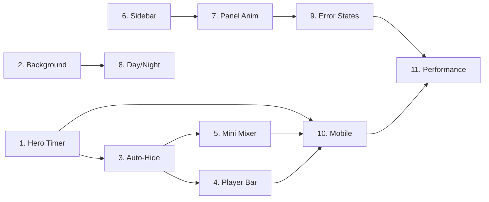

# Amo Lofi — UI V2 Implementation Phases

> Chia nhỏ UI Spec V2 thành các phase theo thứ tự dependency.
> Mỗi phase có thể ship độc lập mà không break các phase trước.

---

## Status Legend

| Icon | Ý nghĩa |
|------|---------|
| ✅ | Đã có trong codebase, chỉ cần tweak nhẹ |
| 🔨 | Cần build mới hoặc refactor lớn |
| ⚡ | Quick win — ít effort, impact cao |

---

## Phase 1: Hero Timer — Trái tim của app
**Complexity: ⭐⭐⭐☆☆ (3/5)**

### Mục tiêu
Chuyển timer từ pill nhỏ (top-center) thành **hero element** lớn, centered giữa màn hình — focal point của toàn bộ trải nghiệm.

### Tại sao làm trước?
Timer là thứ user nhìn 90% thời gian. Thay đổi này tạo **"wow" effect** ngay lập tức và define visual identity mới cho app.

### Đã có sẵn (✅)
- `TimerPill.tsx` — logic timer hoạt động tốt (play/pause, cycle dots, mode colors)
- `useFocusStore` — state management cho timer đã complete
- Timer logic (countdown, pomodoro cycles, modes) — ổn định

### Cần làm (🔨)
| Task | Mô tả | Effort |
|------|--------|--------|
| `HeroTimer.tsx` | Component mới: text 72px, centered, optional ring SVG | Trung bình |
| Task label | Input "What are you working on?" dưới timer | Nhẹ |
| Ring animation | SVG circle `stroke-dashoffset` + glow effect | Trung bình |
| Timer controls | Play/Pause/Skip hiện khi hover vào vùng timer | Nhẹ |
| Refactor `App.tsx` | Đặt HeroTimer ở center thay vì TimerPill ở top | Nhẹ |

### Files thay đổi
- `[NEW]` `components/focus/HeroTimer.tsx`
- `[MODIFY]` `App.tsx` — swap TimerPill → HeroTimer
- `[MODIFY]` `store/useFocusStore.ts` — thêm `taskLabel` state
- `[MODIFY]` `index.css` — thêm ring animation keyframes

---

## Phase 2: Scene Background Upgrade
**Complexity: ⭐⭐☆☆☆ (2/5)**

### Mục tiêu
Đảm bảo background sử dụng **real images** (AI-generated hoặc uploaded) thay vì chỉ CSS gradients, với overlay tối cho readability.

### Tại sao làm sau Phase 1?
Hero Timer cần background đẹp phía sau mới có impact. Hai phase này kết hợp tạo nên visual core.

### Đã có sẵn (✅)
- `SceneBackground.tsx` — **đã support real images**, parallax, crossfade 1.2s
- Mouse parallax — đã implement với `requestAnimationFrame` + `translate3d`
- Film grain effect — đã có
- Vignette overlay — đã có + toggle
- Custom wallpapers — đã support từ IndexedDB

### Cần làm (🔨)
| Task | Mô tả | Effort |
|------|--------|--------|
| Dark overlay điều chỉnh | Thêm adjustable overlay opacity slider vào settings | Nhẹ |
| `prefers-reduced-motion` | Disable parallax khi user chọn reduce motion | Nhẹ |
| Default scenes mới | Thêm real images cho preset scenes (thay CSS gradients) | Nhẹ (asset) |

### Files thay đổi
- `[MODIFY]` `SceneBackground.tsx` — thêm `prefers-reduced-motion` check
- `[MODIFY]` `data/scenes.ts` — update preset scene images
- `[MODIFY]` `store/useLofiStore.ts` — thêm overlay opacity setting

> **Note**: Phase này nhẹ vì `SceneBackground.tsx` đã rất mature. Chủ yếu polish.

---

## Phase 3: Auto-Hide HUD Polish
**Complexity: ⭐⭐☆☆☆ (2/5)**

### Mục tiêu
Polish hệ thống auto-hide hiện tại: thêm **Zen Mode override** (ẩn hết trừ timer), cải thiện transition smoothness.

### Đã có sẵn (✅)
- `useAutoHide.ts` — đã track mouse + keyboard + touch
- Zen Mode toggle — đã có trong store
- Sidebar auto-hide — đã hoạt động

### Cần làm (🔨)
| Task | Mô tả | Effort |
|------|--------|--------|
| Zen Mode enhanced | Ẩn tất cả UI, chỉ giữ HeroTimer + playing dot | Nhẹ |
| Mini mixer fade | Thêm fade riêng cho mini mixer (opacity 20% khi idle) | Nhẹ |
| Playing indicator | Pulsing green dot (bottom-center) luôn visible | Nhẹ |

### Files thay đổi
- `[MODIFY]` `hooks/useAutoHide.ts` — thêm Zen Mode awareness
- `[MODIFY]` `App.tsx` — apply hudVisible classes
- `[MODIFY]` `index.css` — thêm transitions cho các elements

---

## Phase 4: Player Bar Slim-Down
**Complexity: ⭐⭐☆☆☆ (2/5)**

### Mục tiêu
Làm player bar mỏng hơn (40px), transparent khi idle, glass effect khi hover. Progress bar full-width 2px ở top.

### Đã có sẵn (✅)
- `PlayerBar.tsx` — đã có component với đầy đủ controls
- Audio engine — đã hoạt động hoàn chỉnh

### Cần làm (🔨)
| Task | Mô tả | Effort |
|------|--------|--------|
| Height giảm | 40px, layout compact hơn | Nhẹ |
| Auto-fade | Integrate với `useAutoHide` → opacity 30% khi idle | Nhẹ |
| Glass on hover | `backdrop-blur` xuất hiện khi hover | Nhẹ |
| Progress full-width | 2px line top edge thay vì progress bar truyền thống | Nhẹ |

### Files thay đổi
- `[MODIFY]` `components/layout/PlayerBar.tsx` (hoặc tương đương)
- `[MODIFY]` `index.css` — player bar styles

> ⚡ **Quick win** — Chủ yếu CSS changes, logic giữ nguyên.

---

## Phase 5: Mini Mixer Widget
**Complexity: ⭐⭐⭐☆☆ (3/5)**

### Mục tiêu
Tạo widget mixer nhỏ **luôn hiển thị** ở bottom-right (như reference Image 1), cho phép user chỉnh âm thanh mà không cần mở panel.

### Tại sao cần?
Hiện tại user phải: hover sidebar → click 🎵 → mở panel → chỉnh slider. Quá nhiều bước.
Mini mixer giảm xuống: **nhìn thấy → kéo slider**. UX tốt hơn nhiều.

### Đã có sẵn (✅)
- `SoundMixer.tsx` — logic mixer đầy đủ (tabs, sliders, track selector)
- Audio engine hooks — volume, ambience controls

### Cần làm (🔨)
| Task | Mô tả | Effort |
|------|--------|--------|
| `MiniMixer.tsx` | Component mới: 2-3 sliders compact, glass card | Trung bình |
| Expand/collapse | Click header → expand thêm sliders | Nhẹ |
| Auto-fade | Opacity 20% idle → 100% hover | Nhẹ |
| Sync với SoundMixer | Share state — thay đổi ở mini = thay đổi ở full panel | Nhẹ |

### Files thay đổi
- `[NEW]` `components/mixer/MiniMixer.tsx`
- `[MODIFY]` `App.tsx` — render MiniMixer ở bottom-right
- `[MODIFY]` `index.css` — mini mixer styles + auto-fade

---

## Phase 6: Sidebar + Pro Indicators
**Complexity: ⭐⭐☆☆☆ (2/5)**

### Mục tiêu
Polish sidebar hiện tại: thêm **👑 Crown badges** cho Pro features, improve tooltips, thêm fullscreen button.

### Đã có sẵn (✅)
- `Sidebar.tsx` — 230 dòng, đã có hover reveal, pill style, scene-themed icons
- `useProGate.ts` — Pro check logic đã có
- Tooltips — đã implement

### Cần làm (🔨)
| Task | Mô tả | Effort |
|------|--------|--------|
| Crown badge | Thêm 👑 trên Scene icon cho Free users | Nhẹ |
| Fullscreen button | Thêm ⛶ icon vào sidebar | Nhẹ |
| Single panel rule | Mở panel mới → đóng panel cũ | Nhẹ |

### Files thay đổi
- `[MODIFY]` `components/layout/Sidebar.tsx` — crown badge, fullscreen
- `[MODIFY]` `store/useLofiStore.ts` — single panel rule logic

> ⚡ **Quick win** — Sidebar đã hoàn thiện, chỉ add features nhỏ.

---

## Phase 7: Floating Panels Animation
**Complexity: ⭐⭐☆☆☆ (2/5)**

### Mục tiêu
Thống nhất animation cho tất cả floating panels: spring open, ease close, viewport-centered, click-outside-to-close.

### Đã có sẵn (✅)
- Panel components — Scene Selector, Sound Mixer, Focus Panel đều đã hoạt động
- Glass card styling — đã có

### Cần làm (🔨)
| Task | Mô tả | Effort |
|------|--------|--------|
| Shared `FloatingPanel` wrapper | Component chung: glass card + spring animation + Escape close | Trung bình |
| Click outside | Close panel khi click backdrop | Nhẹ |
| Viewport center | Position panels ở center thay vì inline | Nhẹ |
| Z-index hierarchy | Panels=100, Sidebar=90, Timer=80, Player=70 | Nhẹ |

### Files thay đổi
- `[NEW]` `components/layout/FloatingPanel.tsx` — shared wrapper
- `[MODIFY]` `components/scene/SceneSelector.tsx` — wrap with FloatingPanel
- `[MODIFY]` `components/mixer/SoundMixer.tsx` — wrap with FloatingPanel
- `[MODIFY]` `components/focus/FocusPanel.tsx` — wrap with FloatingPanel
- `[MODIFY]` `index.css` — spring animation keyframes

---

## Phase 8: Day/Night Visual Polish
**Complexity: ⭐⭐☆☆☆ (2/5)**

### Mục tiêu
Tạo visual difference rõ ràng giữa Day ☀ và Night 🌙: overlay intensity, glass darkness, glow saturation.

### Đã có sẵn (✅)
- Day/Night toggle — đã có (phím D)
- Scene themes — đã define day/night color tokens
- `useTheme.ts` — applies CSS vars per variant

### Cần làm (🔨)
| Task | Mô tả | Effort |
|------|--------|--------|
| Overlay intensity | Day `0.2` → Night `0.5` opacity | Nhẹ |
| Panel glass tuning | Day lighter → Night darker glass | Nhẹ |
| Timer glow | Day subtle → Night stronger glow | Nhẹ |
| Ambient glow tuning | Day lighter spread → Night deeper saturation | Nhẹ |

### Files thay đổi
- `[MODIFY]` `hooks/useTheme.ts` — expose variant-specific CSS vars
- `[MODIFY]` `index.css` — variant-specific overrides

> ⚡ **Quick win** — Toàn bộ là CSS variable changes.

---

## Phase 9: Error & Empty States
**Complexity: ⭐⭐☆☆☆ (2/5)**

### Mục tiêu
Xử lý các edge cases: no internet, timer complete, empty task list, quota exhausted. Đảm bảo app không bao giờ **blank** hoặc **confusing**.

### Cần làm (🔨)
| Task | Mô tả | Effort |
|------|--------|--------|
| Scene image fallback | CSS gradient khi image fail load | Nhẹ |
| Timer complete overlay | "Break time!" flash + notification sound | Trung bình |
| Empty states | Placeholder text cho empty lists | Nhẹ |
| Quota exhausted UI | Disabled button + upsell CTA | Nhẹ |
| Pro upsell banner | Gradient banner trong Scene Selector | Nhẹ |

### Files thay đổi
- `[MODIFY]` `SceneBackground.tsx` — image error fallback
- `[MODIFY]` `PomodoroTimer.tsx` — complete overlay
- `[MODIFY]` `TaskList.tsx` — empty state
- `[MODIFY]` `SceneSelector.tsx` — upsell banner + quota display

---

## Phase 10: Mobile / Touch Adaptations
**Complexity: ⭐⭐⭐⭐☆ (4/5)**

### Mục tiêu
Làm app **usable trên mobile**: replace hover interactions bằng touch, responsive layout, bottom sheets thay floating panels.

### Tại sao phức tạp?
- Hover sidebar **không hoạt động** trên touch → cần hamburger menu
- Floating panels → bottom sheets (pattern khác hoàn toàn)
- Touch targets tối thiểu 44px
- Landscape vs Portrait layouts

### Cần làm (🔨)
| Task | Mô tả | Effort |
|------|--------|--------|
| Responsive breakpoints | 3 breakpoints: Desktop/Tablet/Mobile | Trung bình |
| Hamburger menu | Thay sidebar hover bằng tap menu icon | Trung bình |
| Bottom sheets | Panels → full-width bottom sheets trên mobile | Nặng |
| Touch targets | Tất cả buttons ≥44px trên mobile | Nhẹ |
| Disable parallax | Tắt mouse parallax trên mobile | Nhẹ |
| Timer responsive | Font 48px trên mobile, ring thinner | Nhẹ |
| Player bar mobile | 56px height, larger controls | Nhẹ |

### Files thay đổi
- `[NEW]` `components/layout/MobileMenu.tsx` — hamburger menu
- `[NEW]` `components/layout/BottomSheet.tsx` — shared bottom sheet wrapper
- `[MODIFY]` `App.tsx` — responsive layout switching
- `[MODIFY]` `index.css` — media queries, touch-action
- `[MODIFY]` Nhiều components — responsive adjustments

> ⚠️ **Phase nặng nhất** — nên để cuối vì desktop experience là priority.

---

## Phase 11: Performance & Polish
**Complexity: ⭐⭐⭐☆☆ (3/5)**

### Mục tiêu
Optimize performance, thêm `prefers-reduced-motion`, audit DOM nodes, bundle size.

### Cần làm (🔨)
| Task | Mô tả | Effort |
|------|--------|--------|
| `prefers-reduced-motion` | Global check, reduce all animations | Trung bình |
| Image lazy loading | Scene images load on-demand | Nhẹ |
| Audio preload strategy | Chỉ preload current + next track | Nhẹ |
| DOM audit | Target <500 nodes | Nhẹ |
| Bundle analysis | `vite-plugin-visualizer`, target <200KB gzipped | Trung bình |
| Lighthouse audit | Target >90 scores | Review |

### Files thay đổi
- `[MODIFY]` `index.css` — `@media (prefers-reduced-motion: reduce)` block
- `[MODIFY]` `SceneBackground.tsx` — lazy image loading
- `[MODIFY]` `hooks/useAudioEngine.ts` — smarter preloading
- `[MODIFY]` `vite.config.ts` — bundle optimization

---

## Tổng quan Phases

```
Phase  │ Tên                    │ Complexity │ Effort    │ Đã có sẵn
───────┼────────────────────────┼────────────┼───────────┼───────────
  1    │ Hero Timer             │ ⭐⭐⭐       │ 2-3 ngày  │ 60%
  2    │ Scene Background       │ ⭐⭐         │ 0.5 ngày  │ 90%
  3    │ Auto-Hide Polish       │ ⭐⭐         │ 0.5 ngày  │ 80%
  4    │ Player Bar Slim        │ ⭐⭐         │ 0.5 ngày  │ 70%
  5    │ Mini Mixer             │ ⭐⭐⭐       │ 1-2 ngày  │ 40%
  6    │ Sidebar + Pro          │ ⭐⭐         │ 0.5 ngày  │ 85%
  7    │ Panel Animations       │ ⭐⭐         │ 1 ngày    │ 50%
  8    │ Day/Night Polish       │ ⭐⭐         │ 0.5 ngày  │ 80%
  9    │ Error & Empty States   │ ⭐⭐         │ 1 ngày    │ 30%
  10   │ Mobile / Touch         │ ⭐⭐⭐⭐     │ 3-5 ngày  │ 10%
  11   │ Performance & Polish   │ ⭐⭐⭐       │ 1-2 ngày  │ 40%
───────┴────────────────────────┴────────────┴───────────┴───────────
                         TỔNG: ~12-16 ngày dev
```

### Suggested grouping cho release
| Release | Phases | Focus |
|---------|--------|-------|
| **V2.0-alpha** | Phase 1-4 | Visual core — Hero Timer + Background + HUD + Player |
| **V2.0-beta** | Phase 5-8 | Features — Mini Mixer + Sidebar + Panels + Day/Night |
| **V2.0-rc** | Phase 9-11 | Polish — Error states + Mobile + Performance |

### Dependency graph

