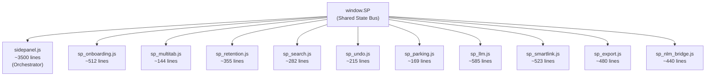

# Sidepanel Module Split Spec
**Version:** 1.1  
**Date:** 2026-02-11  
**Status:** Planning (Reviewed)  
**Author:** AmoNexus Team

---

## 1. Problem Statement

`sidepanel.js` hiện tại chứa **8179 dòng code** (333KB) trong một IIFE duy nhất với ~40 shared closure variables. Toàn bộ logic — từ chat, threads, onboarding, AI calls, export, quiz, search — nằm gọn trong 1 file.

### Tác hại:
- **Maintain khó:** Tìm function mất thời gian, dễ sửa nhầm
- **Debug chậm:** Error stack traces dài, khó trace
- **Conflict khi edit:** 2 features khác nhau cùng 1 file
- **Load time:** Browser parse 333KB đồng thời

### Mục tiêu:
- Giảm `sidepanel.js` từ **8179 → ~3500 lines**
- Tách thành **10 modules** nhỏ, mỗi module 1 domain
- **Zero behavior changes** — pure structural refactor

---

## 2. Architecture: Shared State Bus

Vì tất cả functions chia sẻ state qua closure, cần một **Shared State object** (`window.SP`) làm cầu nối.



### `window.SP` sẽ chứa:
```javascript
window.SP = {
    // Core state (read/write bởi nhiều modules)
    pageContext: null,
    threads: [],
    activeThreadId: null,
    isLoading: false,
    elements: {},
    activeMainTab: 'chat',
    API_CONFIG: { /* ... */ },

    // Shared helpers (set bởi sidepanel.js sau init)
    getMessage: null,
    getIcon: null,
    showToast: null,
    getApiKey: null,
};
```

---

## 3. Current Code Map (verified 2026-02-11)

| Lines | Domain | ~Lines | Module đích |
|-------|--------|--------|-------------|
| 4-81 | State & Config | 77 | → `window.SP` (Phase 1) |
| 82-206 | Config loading, Feature flags | 124 | Giữ lại |
| 208-706 | Command system (handlers) | 498 | Giữ lại |
| 707-790 | Context levels, Network, State | 83 | Giữ lại |
| **791-1302** | **Onboarding system** | **~512** | `sp_onboarding.js` |
| 1303-1316 | Search/MultiTab state vars | 13 | Giữ lại |
| 1317-1390 | Helpers (i18n, icons, applyI18n) | 73 | Giữ lại |
| 1392-1490 | `init()` orchestrator | 98 | Giữ lại |
| 1492-1970 | Learning Mode, Primer, Semantic Brain | 478 | Giữ lại (coupled) |
| **1972-2326** | **Retention (Quiz/TeachBack/Flashcard)** | **~355** | `sp_retention.js` |
| **2328-2471** | **Multi-Tab Handling** | **~144** | `sp_multitab.js` |
| **2473-2754** | **Search & Filter** | **~282** | `sp_search.js` |
| 2756-3865 | Tabs, Notes, Actions, Events, Highlights | 1109 | Giữ lại (core UI) |
| **3867-4389** | **Smart Linking & Connections** | **~523** | `sp_smartlink.js` |
| 4391-4990 | Thread mgmt, Rendering, Page context | 599 | Giữ lại (core) |
| 4992-5007 | Tab change handling | 15 | Giữ lại (core) |
| 5009-5219 | Chat (handleSend, handleQuickAction) | 210 | Giữ lại (core) |
| 5221-5662 | sendToGemini, buildSystemPrompt, AutoSummary | 441 | Giữ lại (core chat) |
| **5766-6185** | **LLM Provider Adapter** | **~420** | `sp_llm.js` |
| **6186-6351** | **Error Handling + Rate Limit** | **~165** | `sp_llm.js` |
| **6352-6566** | **Undo System** | **~215** | `sp_undo.js` |
| 6568-6698 | UI Helpers | 130 | Giữ lại |
| **6700-6868** | **Parking Lot** | **~169** | `sp_parking.js` |
| **6876-7314** | **NotebookLM Bridge (Atomic Thought + Save)** | **~440** | `sp_nlm_bridge.js` |
| 7316-7337 | showToast | 21 | Giữ lại |
| **7339-7818** | **Export System** | **~480** | `sp_export.js` |
| 7820-8179 | Deep Angle, SRQ, Theme, Init | 359 | Giữ lại |

**Tổng extractable: ~3705 lines → sidepanel.js còn ~3500 lines + sp_state.js ~80 lines**

---

## 4. Implementation Phases

### Phase 1: Shared State Bus (Foundation)
| | |
|-|-|
| **Risk** | 🟢 Thấp |
| **Effort** | 2-3 giờ |
| **Lines** | Refactor only (thêm `sp_state.js` ~50 lines) |

**Việc cần làm:**
1. Tạo `sp_state.js` — khai báo `window.SP` với tất cả shared state
2. Trong `sidepanel.js`: thêm aliases (`window.SP.threads = threads`)
3. Expose helpers: `window.SP.getMessage = getMessage`
4. **Không thay đổi logic nào**

**Kiểm tra:**
- [ ] Extension load không lỗi
- [ ] Chat, tabs, commands hoạt động bình thường
- [ ] `console.log(window.SP.threads)` trả kết quả đúng

---

### Phase 2: Onboarding + Multi-Tab (~654 lines)
| | |
|-|-|
| **Risk** | 🟢 Thấp |
| **Effort** | 3-4 giờ |
| **Lines tách** | ~654 |

**Tại sao làm trước?** Onboarding là hệ thống tự chứa nhất. Có state, rendering, và lifecycle riêng.

**Modules:**

| File | Lines | Nội dung |
|------|-------|----------|
| `sp_onboarding.js` | ~511 | Welcome screen, tooltips, progress tracking, onboarding state |
| `sp_multitab.js` | ~143 | BroadcastChannel, session detection, multi-tab warning |

**Dependencies cần từ SP:**
- `SP.getMessage()`, `SP.getIcon()`, `SP.showToast()`
- `SP.elements` (DOM refs)

**Kiểm tra:**
- [ ] User mới mở Side Panel → Welcome screen hiện
- [ ] Onboarding tooltips hiện đúng trình tự
- [ ] Mở 2 Side Panel → Multi-tab warning hiện

---

### Phase 3: Retention + Search + Undo + Parking (~1000 lines)
| | |
|-|-|
| **Risk** | 🟡 Trung bình |
| **Effort** | 4-5 giờ |
| **Lines tách** | ~1000 |

**Modules:**

| File | Lines | Nội dung |
|------|-------|----------|
| `sp_retention.js` | ~354 | Quiz, TeachBack, Flashcard flows |
| `sp_search.js` | ~281 | Quick search (Ctrl+F), filter, results |
| `sp_undo.js` | ~197 | Undo toast, countdown, action management |
| `sp_parking.js` | ~168 | Parking lot for draft ideas |

**Dependencies:**
- `sp_retention.js` → `SP.callLLMAPI()` (vẫn ở main lúc này), `SP.getMessage()`, `SP.getApiKey()`
- `sp_search.js` → `SP.threads`, `SP.elements`, `switchMainTab()` (từ main)
- `sp_parking.js` → `SP.threads`, `createUndoableAction()` (từ `sp_undo.js`)

**Kiểm tra:**
- [ ] Quiz/TeachBack/Flashcard hoạt động
- [ ] Ctrl+F search tìm threads và notes
- [ ] Undo toast hiện và undo thành công
- [ ] Parking lot lưu/hiện/promote ideas

---

### Phase 4: LLM Adapter + Smart Linking (~1108 lines)
| | |
|-|-|
| **Risk** | 🔴 **Cao** |
| **Effort** | 8-12 giờ |
| **Lines tách** | ~1108 |

> ⚠️ **Rủi ro cao nhất.** LLM adapter được dùng bởi: chat, retention, smart linking, auto-summary. Tất cả callers phải update để gọi qua module mới.

> ⚠️ **LƯU Ý QUAN TRỌNG:** `sendToGemini()`, `buildSystemPrompt()`, `buildConversationHistory()`, auto-summary — đây là **core chat logic**, GIỮ LẠI trong `sidepanel.js`. Chỉ extract phần provider adapter thuần túy.

**Modules:**

| File | Lines | Nội dung |
|------|-------|----------|
| `sp_llm.js` | ~585 | `getLLMProvider()`, `callLLMAPI()`, `callGeminiAPI()`, `callOpenRouterAPI()`, `convertToOpenRouterMessages()`, `ApiError`, error handling, retry, rate limit countdown |
| `sp_smartlink.js` | ~523 | `detectConnections()`, `analyzeConnections()`, `getSemanticCandidateThreads()`, `generateDeepAngleFromConnections()`, connection rendering |

**Exposed API:**
```javascript
window.SP.callLLMAPI = callLLMAPI;
window.SP.callGeminiAPI = callGeminiAPI;
window.SP.getApiKey = getApiKey;
window.SP.getLLMProvider = getLLMProvider;
```

**Kiểm tra:**
- [ ] Chat vẫn nhận response từ AI
- [ ] Smart linking detect connections giữa threads
- [ ] Deep Angle generate insights
- [ ] Rate limit countdown hoạt động
- [ ] Retry mechanism hoạt động khi API error
- [ ] OpenRouter fallback hoạt động

---

### Phase 5: Export + NLM Bridge (~920 lines)
| | |
|-|-|
| **Risk** | 🟢 Thấp |
| **Effort** | 4-5 giờ |
| **Lines tách** | ~920 |

**Modules:**

| File | Lines | Nội dung |
|------|-------|----------|
| `sp_export.js` | ~480 | Export dialog, Markdown/JSON/Text formats, download, legacy export |
| `sp_nlm_bridge.js` | ~440 | `makeAtomicThought()`, `saveThreadToNLM()`, `exportAllToNLM()`, insight rendering, loading states |

**Kiểm tra:**
- [ ] Export dialog mở với tất cả format options
- [ ] Download Markdown/JSON/Text thành công
- [ ] Key Insight (Ctrl+D) generate và save
- [ ] Save to NLM hoạt động
- [ ] Export All to NLM hoạt động

---

## 5. Load Order trong `sidepanel.html`

> **Lưu ý:** `sidepanel.html` hiện tại đã load **37+ scripts** (services, ui/components, ui/controllers, storage, config). Các module mới sẽ được chèn VÀO GIỮA chuỗi hiện có.

```html
<!-- 1. Config & Storage (đã có) -->
<script src="config/build_flags.js"></script>
<script src="utils/console_guard.js"></script>
<script src="storage/reading_session.js"></script>
<script src="config/feature_flags.js"></script>

<!-- 2. State Bus (MỚI - Phase 1) -->
<script src="sp_state.js"></script>

<!-- 3. Services (đã có - 20+ files) -->
<script src="services/rate_limit_manager.js"></script>
<!-- ... services/learning_objective, primer_service, quiz_generator, ... -->
<script src="services/command_router.js"></script>
<script src="services/intent_parser.js"></script>
<script src="services/action_executor.js"></script>

<!-- 4. UI Components & Controllers (đã có) -->
<script src="ui/controllers/toast_manager.js"></script>
<script src="ui/controllers/tab_controller.js"></script>
<script src="ui/controllers/focus_bar.js"></script>
<script src="ui/controllers/command_menu.js"></script>
<script src="ui/controllers/quick_diary.js"></script>
<script src="utils/i18n_classic.js"></script>
<script src="utils_ui.js"></script>

<!-- 5. Extracted Modules (MỚI - Phase 2-5, dependency order) -->
<script src="sp_undo.js"></script>          <!-- sp_parking cần -->
<script src="sp_llm.js"></script>           <!-- sp_retention, sp_smartlink cần -->
<script src="sp_onboarding.js"></script>
<script src="sp_multitab.js"></script>
<script src="sp_retention.js"></script>
<script src="sp_search.js"></script>
<script src="sp_parking.js"></script>
<script src="sp_smartlink.js"></script>
<script src="sp_export.js"></script>
<script src="sp_nlm_bridge.js"></script>

<!-- 6. Main orchestrator (PHẢI load cuối cùng) -->
<script src="sidepanel.js"></script>
```

---

## 6. Nguyên tắc chung

1. **Test sau MỖI phase** — không gom nhiều phases lại
2. **Git branch riêng cho mỗi phase** — dễ rollback
3. **Giữ aliases** — `sidepanel.js` vẫn reference functions qua `window.SP`
4. **Zero logic changes** — chỉ refactor cấu trúc, không thay đổi hành vi
5. **Backup** `sidepanel.js` trước khi bắt đầu

---

## 7. Kết quả cuối cùng

| File | ~Lines | Domain |
|------|--------|--------|
| `sp_state.js` | ~80 | Shared state bus + debug helpers |
| `sidepanel.js` | ~3500 | Orchestrator, core chat, tabs, threads |
| `sp_onboarding.js` | ~512 | Welcome, tooltips, progress |
| `sp_multitab.js` | ~144 | Multi-tab coordination |
| `sp_retention.js` | ~355 | Quiz, TeachBack, Flashcard |
| `sp_search.js` | ~282 | Quick search & filter |
| `sp_undo.js` | ~215 | Undo actions with toast |
| `sp_parking.js` | ~169 | Parking lot for ideas |
| `sp_llm.js` | ~585 | LLM provider adapter (Gemini + OpenRouter) |
| `sp_smartlink.js` | ~523 | Connection detection, semantic candidates |
| `sp_export.js` | ~480 | Multi-format export |
| `sp_nlm_bridge.js` | ~440 | Atomic Thought + NLM save + export all |
| **Tổng** | **~7285** | (trước: 8179 trong 1 file) |

---

## 8. Timeline ước tính

| Phase | Effort | Tích luỹ |
|-------|--------|----------|
| Phase 1 | 2-3h | 2-3h |
| Phase 2 | 3-4h | 5-7h |
| Phase 3a | 2-3h | 7-10h |
| Phase 3b | 3-4h | 10-14h |
| Phase 4 | 8-12h | 18-26h |
| Phase 5 | 4-5h | 22-31h |

**Tổng: ~22-31 giờ làm việc (4-5 ngày)**
