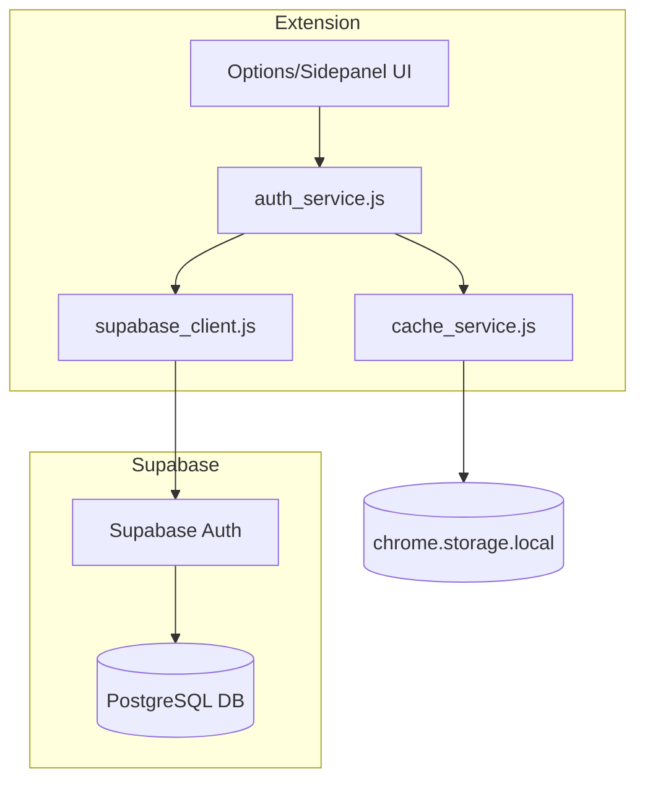
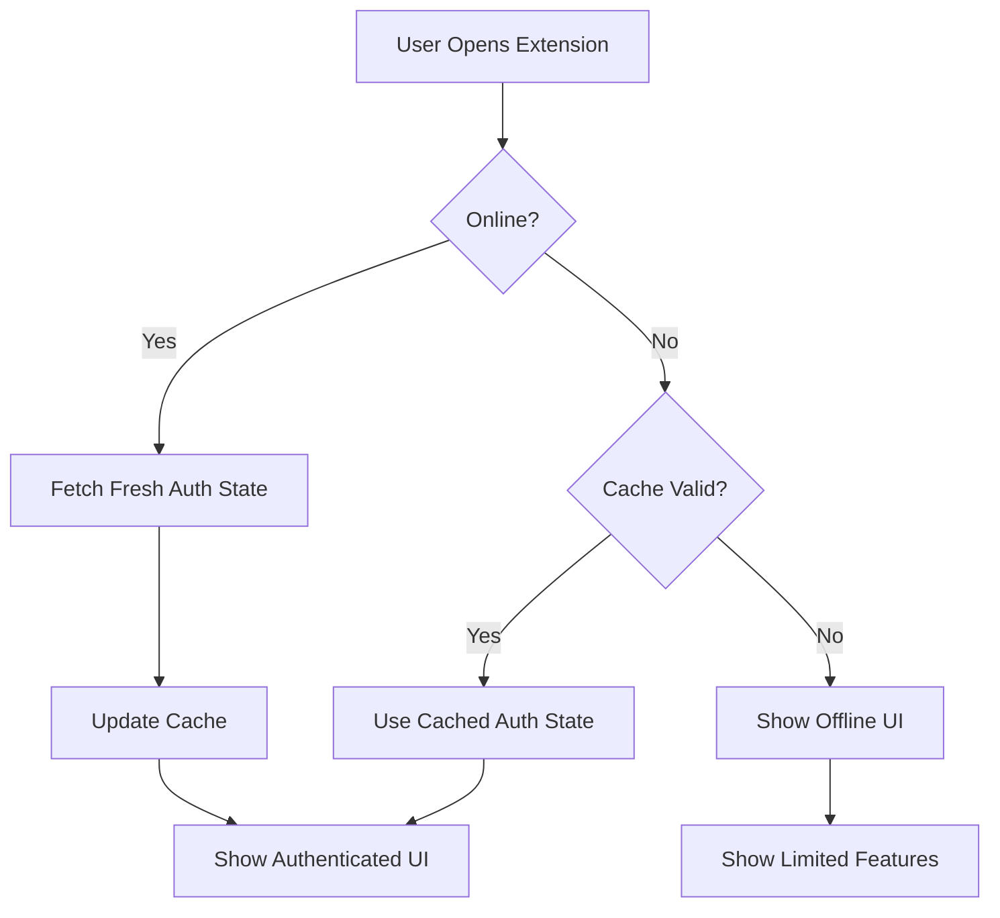
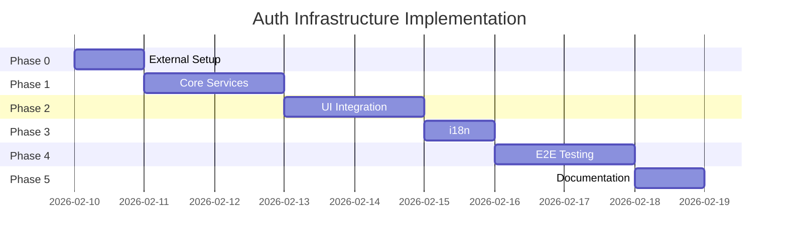

# User Authentication & Account Infrastructure Specification

**Version:** 1.0
**Date:** 2026-02-09
**Status:** Draft
**Priority:** P0 (Foundation for monetization)
**Based on:** [monetization_plan.md](file:///d:/Amo/ATOM_Extension_V2.8_public/ideas/monetization_plan.md)

---

## 1. Overview

### 1.1 Purpose
Implement user authentication and account management infrastructure using **Supabase**, preparing the foundation for future payment integration with Lemon Squeezy.

### 1.2 Goals
- ✅ **User Identity** - Users can sign in with Google/Email via Supabase Auth
- ✅ **Account Sync** - User profile stored in Supabase PostgreSQL
- ✅ **MV3 Compatible** - Auth works in Chrome Extension Manifest V3 Service Workers
- ✅ **Payment Ready** - Database schema supports subscription status for future Pro tier
- ✅ **Offline Resilient** - Cached auth state for offline usage

### 1.3 Non-Goals (Phase 1)
- ❌ Payment processing (future Phase 2)
- ❌ Feature gating/Pro tier logic (future Phase 2)
- ❌ Cloud data sync (future Phase 3)
- ❌ Multi-provider auth (only Google in Phase 1)

---

## 2. Architecture

### 2.1 High-Level Diagram



### 2.2 Component Responsibilities

| Component | Responsibility |
|-----------|---------------|
| `supabase_client.js` | Initialize Supabase client with MV3-compatible storage adapter |
| `auth_service.js` | Handle sign-in, sign-out, session management |
| `cache_service.js` | Manage local auth state caching for offline |
| Options UI | Display login/logout buttons, user profile |

---

## 3. Database Schema (Supabase)

### 3.1 Table: `profiles`

```sql
CREATE TABLE profiles (
  id UUID PRIMARY KEY REFERENCES auth.users(id) ON DELETE CASCADE,
  email TEXT NOT NULL,
  display_name TEXT,
  avatar_url TEXT,
  
  -- Subscription fields (prepared for future)
  is_pro BOOLEAN DEFAULT false,
  plan_variant_id TEXT,
  subscription_status TEXT DEFAULT 'free' CHECK (subscription_status IN ('free', 'active', 'trialing', 'cancelled', 'past_due', 'expired')),
  subscription_end_date TIMESTAMPTZ,
  lemon_squeezy_customer_id TEXT,
  trial_ends_at TIMESTAMPTZ,
  last_verified_at TIMESTAMPTZ,
  
  -- Metadata
  created_at TIMESTAMPTZ DEFAULT NOW(),
  updated_at TIMESTAMPTZ DEFAULT NOW()
);

-- Enable RLS
ALTER TABLE profiles ENABLE ROW LEVEL SECURITY;
```

### 3.2 Row Level Security (RLS) Policies

```sql
-- Users can only read their own profile
CREATE POLICY "Users can view own profile" 
  ON profiles FOR SELECT 
  USING (auth.uid() = id);

-- Users can update limited fields of their own profile
CREATE POLICY "Users can update own profile" 
  ON profiles FOR UPDATE 
  USING (auth.uid() = id)
  WITH CHECK (auth.uid() = id);

-- Auto-create profile on first sign-in
CREATE OR REPLACE FUNCTION handle_new_user()
RETURNS TRIGGER AS $$
BEGIN
  INSERT INTO public.profiles (id, email, display_name, avatar_url)
  VALUES (
    NEW.id,
    NEW.email,
    NEW.raw_user_meta_data->>'full_name',
    NEW.raw_user_meta_data->>'avatar_url'
  );
  RETURN NEW;
END;
$$ LANGUAGE plpgsql SECURITY DEFINER;

CREATE TRIGGER on_auth_user_created
  AFTER INSERT ON auth.users
  FOR EACH ROW EXECUTE FUNCTION handle_new_user();
```

---

## 4. Technical Implementation

### 4.1 Supabase Client for MV3

> [!IMPORTANT]
> Chrome Extension MV3 Service Workers do **not** have access to `localStorage` or `document.cookie`. We need a custom storage adapter using `chrome.storage.local`.

#### [NEW] `lib/supabase_client.js`

```javascript
import { createClient } from '@supabase/supabase-js';

const SUPABASE_URL = 'https://YOUR_PROJECT.supabase.co';
const SUPABASE_ANON_KEY = 'YOUR_ANON_KEY';

/**
 * Custom storage adapter for Chrome Extension MV3
 * Uses chrome.storage.local instead of localStorage
 */
const chromeStorageAdapter = {
  getItem: async (key) => {
    const result = await chrome.storage.local.get(key);
    return result[key] ?? null;
  },
  setItem: async (key, value) => {
    await chrome.storage.local.set({ [key]: value });
  },
  removeItem: async (key) => {
    await chrome.storage.local.remove(key);
  }
};

/**
 * Initialize Supabase client with MV3-compatible storage
 */
export const supabase = createClient(SUPABASE_URL, SUPABASE_ANON_KEY, {
  auth: {
    storage: chromeStorageAdapter,
    autoRefreshToken: true,
    persistSession: true,
    detectSessionInUrl: false  // Disabled for extension
  }
});

/**
 * Get current session
 * @returns {Promise<Session|null>}
 */
export async function getSession() {
  const { data: { session } } = await supabase.auth.getSession();
  return session;
}

/**
 * Get current user
 * @returns {Promise<User|null>}
 */
export async function getUser() {
  const { data: { user } } = await supabase.auth.getUser();
  return user;
}
```

---

### 4.2 Auth Service

#### [NEW] `services/auth_service.js`

```javascript
import { supabase, getSession, getUser } from '../lib/supabase_client.js';
import { cacheAuthState, getCachedAuthState, clearAuthCache } from './cache_service.js';

const AUTH_EVENTS = {
  SIGNED_IN: 'SIGNED_IN',
  SIGNED_OUT: 'SIGNED_OUT',
  USER_UPDATED: 'USER_UPDATED',
  TOKEN_REFRESHED: 'TOKEN_REFRESHED'
};

/**
 * Sign in with Google OAuth
 * Opens a popup for Google authentication
 * @returns {Promise<{user: User, session: Session} | null>}
 */
export async function signInWithGoogle() {
  try {
    const { data, error } = await supabase.auth.signInWithOAuth({
      provider: 'google',
      options: {
        redirectTo: chrome.identity.getRedirectURL(),
        skipBrowserRedirect: true  // Handle redirect manually for extension
      }
    });

    if (error) throw error;

    // Use chrome.identity.launchWebAuthFlow for OAuth in extension
    const authUrl = data.url;
    const redirectUrl = await new Promise((resolve, reject) => {
      chrome.identity.launchWebAuthFlow(
        { url: authUrl, interactive: true },
        (responseUrl) => {
          if (chrome.runtime.lastError) {
            reject(new Error(chrome.runtime.lastError.message));
          } else {
            resolve(responseUrl);
          }
        }
      );
    });

    // Extract tokens from redirect URL
    const url = new URL(redirectUrl);
    const hashParams = new URLSearchParams(url.hash.substring(1));
    const accessToken = hashParams.get('access_token');
    const refreshToken = hashParams.get('refresh_token');

    if (accessToken) {
      // Set session manually
      const { data: sessionData, error: sessionError } = await supabase.auth.setSession({
        access_token: accessToken,
        refresh_token: refreshToken
      });

      if (sessionError) throw sessionError;

      // Cache auth state
      await cacheAuthState(sessionData.user, sessionData.session);

      // Fetch and cache user profile
      await getUserProfile();

      return sessionData;
    }

    return null;
  } catch (error) {
    console.error('[ATOM Auth] Sign in failed:', error);
    throw error;
  }
}

/**
 * Sign out current user
 * @returns {Promise<void>}
 */
export async function signOut() {
  try {
    const { error } = await supabase.auth.signOut();
    if (error) throw error;

    // Clear cached auth state
    await clearAuthCache();

    console.log('[ATOM Auth] Signed out successfully');
  } catch (error) {
    console.error('[ATOM Auth] Sign out failed:', error);
    throw error;
  }
}

/**
 * Get user profile from Supabase
 * @returns {Promise<Profile|null>}
 */
export async function getUserProfile() {
  try {
    const user = await getUser();
    if (!user) return null;

    const { data, error } = await supabase
      .from('profiles')
      .select('*')
      .eq('id', user.id)
      .single();

    if (error) throw error;

    // Cache profile data
    await chrome.storage.local.set({
      'atom_user_profile': {
        ...data,
        cached_at: Date.now()
      }
    });

    return data;
  } catch (error) {
    console.error('[ATOM Auth] Get profile failed:', error);
    return null;
  }
}

/**
 * Check if user is authenticated
 * @returns {Promise<boolean>}
 */
export async function isAuthenticated() {
  const session = await getSession();
  return !!session;
}

/**
 * Get current auth state (cached or fresh)
 * @param {boolean} forceRefresh - Force fetch from server
 * @returns {Promise<AuthState>}
 */
export async function getAuthState(forceRefresh = false) {
  // Try cache first if not forcing refresh
  if (!forceRefresh) {
    const cached = await getCachedAuthState();
    if (cached && !cached.expired) {
      return cached;
    }
  }

  // Fetch fresh state
  const session = await getSession();
  const user = session?.user ?? null;
  const profile = user ? await getUserProfile() : null;

  const authState = {
    isAuthenticated: !!user,
    user: user ? {
      id: user.id,
      email: user.email,
      displayName: user.user_metadata?.full_name,
      avatarUrl: user.user_metadata?.avatar_url
    } : null,
    profile: profile,
    isPro: profile?.is_pro ?? false,
    subscriptionStatus: profile?.subscription_status ?? 'free'
  };

  // Cache the state
  await cacheAuthState(authState);

  return authState;
}

/**
 * Listen for auth state changes
 * @param {Function} callback
 * @returns {Function} Unsubscribe function
 */
export function onAuthStateChange(callback) {
  const { data: { subscription } } = supabase.auth.onAuthStateChange(
    async (event, session) => {
      console.log('[ATOM Auth] State changed:', event);

      if (event === 'SIGNED_IN' || event === 'TOKEN_REFRESHED') {
        const profile = await getUserProfile();
        callback(event, { session, profile });
      } else if (event === 'SIGNED_OUT') {
        await clearAuthCache();
        callback(event, null);
      }
    }
  );

  return () => subscription.unsubscribe();
}
```

---

### 4.3 Cache Service

#### [NEW] `services/cache_service.js`

```javascript
const CACHE_KEYS = {
  AUTH_STATE: 'atom_auth_cache',
  USER_PROFILE: 'atom_user_profile'
};

const DEFAULT_TTL = 24 * 60 * 60 * 1000; // 24 hours

/**
 * Cache auth state with TTL
 * @param {AuthState} authState
 * @param {number} ttl - Time to live in ms
 */
export async function cacheAuthState(authState, ttl = DEFAULT_TTL) {
  const cacheData = {
    ...authState,
    cached_at: Date.now(),
    ttl: ttl,
    expires_at: Date.now() + ttl
  };

  await chrome.storage.local.set({
    [CACHE_KEYS.AUTH_STATE]: cacheData
  });

  console.log('[ATOM Cache] Auth state cached, expires:', new Date(cacheData.expires_at).toISOString());
}

/**
 * Get cached auth state
 * @returns {Promise<AuthState|null>}
 */
export async function getCachedAuthState() {
  const result = await chrome.storage.local.get(CACHE_KEYS.AUTH_STATE);
  const cached = result[CACHE_KEYS.AUTH_STATE];

  if (!cached) return null;

  // Check if expired
  const now = Date.now();
  if (now > cached.expires_at) {
    cached.expired = true;
  }

  return cached;
}

/**
 * Clear all auth-related cache
 */
export async function clearAuthCache() {
  await chrome.storage.local.remove([
    CACHE_KEYS.AUTH_STATE,
    CACHE_KEYS.USER_PROFILE,
    // Supabase session keys
    'supabase.auth.token'
  ]);

  console.log('[ATOM Cache] Auth cache cleared');
}

/**
 * Check if cache is valid (not expired)
 * @returns {Promise<boolean>}
 */
export async function isCacheValid() {
  const cached = await getCachedAuthState();
  return cached && !cached.expired;
}
```

---

### 4.4 UI Integration

#### [MODIFY] `options.html` - Add Account Section

```html
<!-- Add new tab in navigation -->
<button class="nav-tab" data-tab="account">
  <span class="nav-icon">👤</span>
  <span data-i18n="opt_tab_account">Account</span>
</button>

<!-- Add Account Panel -->
<div id="panel-account" class="tab-panel">
  <h2>
    <svg><!-- user icon --></svg>
    <span data-i18n="opt_account_title">Account</span>
  </h2>

  <!-- Logged Out State -->
  <div id="auth-logged-out" class="setting-section">
    <div class="hero-box">
      <h3 data-i18n="opt_account_signin_title">Sign in to AmoNexus</h3>
      <p data-i18n="opt_account_signin_desc">
        Sign in to sync your data across devices and unlock Pro features.
      </p>
      <button id="btn-google-signin" class="btn-get-key">
        <span>🔐</span>
        <span data-i18n="opt_account_signin_google">Sign in with Google</span>
      </button>
    </div>
  </div>

  <!-- Logged In State -->
  <div id="auth-logged-in" class="setting-section" style="display: none;">
    <!-- User Info Card -->
    <div class="user-info-card">
      
      <div class="user-details">
        <span id="user-name" class="user-name"></span>
        <span id="user-email" class="user-email"></span>
        <span id="user-plan" class="user-plan-badge">Free</span>
      </div>
    </div>

    <!-- Account Actions -->
    <div class="account-actions">
      <button id="btn-upgrade-pro" class="btn-action primary" style="display: none;">
        <span>⭐</span>
        <span data-i18n="opt_account_upgrade">Upgrade to Pro</span>
      </button>
      
      <button id="btn-manage-subscription" class="btn-action" style="display: none;">
        <span>💳</span>
        <span data-i18n="opt_account_manage">Manage Subscription</span>
      </button>
      
      <button id="btn-signout" class="btn-action danger">
        <span>🚪</span>
        <span data-i18n="opt_account_signout">Sign Out</span>
      </button>
    </div>
  </div>

  <!-- Sync Status -->
  <div class="setting-section">
    <div class="info-box">
      <span class="info-icon">ℹ️</span>
      <span data-i18n="opt_account_sync_info">
        Your settings are stored locally. Cloud sync coming soon!
      </span>
    </div>
  </div>
</div>
```

#### [MODIFY] `options.js` - Add Auth Handlers

```javascript
// Import auth service (add to top of file)
import { 
  signInWithGoogle, 
  signOut, 
  getAuthState, 
  onAuthStateChange 
} from './services/auth_service.js';

// Add to DOMContentLoaded
document.addEventListener('DOMContentLoaded', async () => {
  // ... existing code ...
  
  // Initialize auth UI
  await initAuthUI();
});

/**
 * Initialize authentication UI
 */
async function initAuthUI() {
  // Get current auth state
  const authState = await getAuthState();
  updateAuthUI(authState);

  // Listen for auth changes
  onAuthStateChange((event, data) => {
    if (event === 'SIGNED_IN') {
      updateAuthUI({ isAuthenticated: true, ...data });
    } else if (event === 'SIGNED_OUT') {
      updateAuthUI({ isAuthenticated: false });
    }
  });

  // Sign in button
  document.getElementById('btn-google-signin')?.addEventListener('click', async () => {
    try {
      const btn = document.getElementById('btn-google-signin');
      btn.disabled = true;
      btn.textContent = atomMsg('opt_account_signing_in', null, 'Signing in...');

      await signInWithGoogle();
      
      const authState = await getAuthState(true);
      updateAuthUI(authState);
    } catch (error) {
      console.error('[ATOM Auth] Sign in error:', error);
      showToast(atomMsg('opt_account_signin_error', null, 'Sign in failed. Please try again.'), 'error');
    } finally {
      const btn = document.getElementById('btn-google-signin');
      btn.disabled = false;
      btn.innerHTML = '<span>🔐</span><span>' + atomMsg('opt_account_signin_google') + '</span>';
    }
  });

  // Sign out button
  document.getElementById('btn-signout')?.addEventListener('click', async () => {
    try {
      await signOut();
      updateAuthUI({ isAuthenticated: false });
      showToast(atomMsg('opt_account_signout_success', null, 'Signed out successfully'), 'success');
    } catch (error) {
      console.error('[ATOM Auth] Sign out error:', error);
    }
  });
}

/**
 * Update auth UI based on state
 * @param {AuthState} authState
 */
function updateAuthUI(authState) {
  const loggedOutSection = document.getElementById('auth-logged-out');
  const loggedInSection = document.getElementById('auth-logged-in');

  if (authState.isAuthenticated) {
    loggedOutSection.style.display = 'none';
    loggedInSection.style.display = 'block';

    // Update user info
    document.getElementById('user-avatar').src = authState.user?.avatarUrl || 'icons/default-avatar.png';
    document.getElementById('user-name').textContent = authState.user?.displayName || 'User';
    document.getElementById('user-email').textContent = authState.user?.email || '';

    // Update plan badge
    const planBadge = document.getElementById('user-plan');
    if (authState.isPro) {
      planBadge.textContent = 'Pro ⭐';
      planBadge.classList.add('pro');
      document.getElementById('btn-upgrade-pro').style.display = 'none';
      document.getElementById('btn-manage-subscription').style.display = 'flex';
    } else {
      planBadge.textContent = 'Free';
      planBadge.classList.remove('pro');
      document.getElementById('btn-upgrade-pro').style.display = 'flex';
      document.getElementById('btn-manage-subscription').style.display = 'none';
    }
  } else {
    loggedOutSection.style.display = 'block';
    loggedInSection.style.display = 'none';
  }
}
```

---

## 5. Configuration & Environment

### 5.1 Environment Variables

> [!CAUTION]
> **Never commit API keys to source control!**

Create `config/supabase_config.js`:

```javascript
// Replace with your Supabase project values
export const SUPABASE_CONFIG = {
  URL: 'https://YOUR_PROJECT_ID.supabase.co',
  ANON_KEY: 'YOUR_ANON_KEY'
};
```

Add to `.gitignore`:
```
config/supabase_config.js
```

### 5.2 Supabase Project Setup

1. Go to [supabase.com](https://supabase.com) → Create new project
2. **Authentication** → Providers → Enable **Google**
3. **Google Cloud Console**:
   - Create OAuth Client ID (Web Application)
   - Add Authorized redirect URI: `https://YOUR_PROJECT.supabase.co/auth/v1/callback`
   - Add Chrome Extension redirect: `https://<EXTENSION_ID>.chromiumapp.org/`
4. Copy Client ID & Secret to Supabase Google provider settings
5. **Database** → SQL Editor → Run the schema SQL from Section 3

### 5.3 Manifest.json Updates

```json
{
  "permissions": [
    "identity",    // NEW: Required for OAuth
    "storage",
    "tabs"
  ],
  "oauth2": {
    "client_id": "YOUR_GOOGLE_CLIENT_ID.apps.googleusercontent.com",
    "scopes": ["openid", "email", "profile"]
  }
}
```

---

## 6. Error Handling

### 6.1 Error Types

| Error | Cause | User Message |
|-------|-------|--------------|
| `NETWORK_ERROR` | No internet | "Cannot connect. Check your internet connection." |
| `AUTH_POPUP_CLOSED` | User closed OAuth popup | "Sign in cancelled." |
| `INVALID_SESSION` | Session expired/invalid | "Session expired. Please sign in again." |
| `PROFILE_NOT_FOUND` | Profile not in DB | (Auto-create via trigger) |
| `RATE_LIMITED` | Too many attempts | "Too many attempts. Please wait a moment." |

### 6.2 Offline Behavior



---

## 7. i18n Keys

### 7.1 English Keys

```json
{
  "opt_tab_account": { "message": "Account" },
  "opt_account_title": { "message": "Account" },
  "opt_account_signin_title": { "message": "Sign in to AmoNexus" },
  "opt_account_signin_desc": { "message": "Sign in to sync your data across devices and unlock Pro features." },
  "opt_account_signin_google": { "message": "Sign in with Google" },
  "opt_account_signing_in": { "message": "Signing in..." },
  "opt_account_signin_error": { "message": "Sign in failed. Please try again." },
  "opt_account_signout": { "message": "Sign Out" },
  "opt_account_signout_success": { "message": "Signed out successfully" },
  "opt_account_upgrade": { "message": "Upgrade to Pro" },
  "opt_account_manage": { "message": "Manage Subscription" },
  "opt_account_sync_info": { "message": "Your settings are stored locally. Cloud sync coming soon!" }
}
```

### 7.2 Vietnamese Keys

```json
{
  "opt_tab_account": { "message": "Tài khoản" },
  "opt_account_title": { "message": "Tài khoản" },
  "opt_account_signin_title": { "message": "Đăng nhập AmoNexus" },
  "opt_account_signin_desc": { "message": "Đăng nhập để đồng bộ dữ liệu giữa các thiết bị và mở khóa tính năng Pro." },
  "opt_account_signin_google": { "message": "Đăng nhập với Google" },
  "opt_account_signing_in": { "message": "Đang đăng nhập..." },
  "opt_account_signin_error": { "message": "Đăng nhập thất bại. Vui lòng thử lại." },
  "opt_account_signout": { "message": "Đăng xuất" },
  "opt_account_signout_success": { "message": "Đã đăng xuất" },
  "opt_account_upgrade": { "message": "Nâng cấp lên Pro" },
  "opt_account_manage": { "message": "Quản lý Thuê bao" },
  "opt_account_sync_info": { "message": "Cài đặt được lưu cục bộ. Đồng bộ đám mây sẽ sớm ra mắt!" }
}
```

---

## 8. Phased Implementation Plan

---

### Phase 0: External Setup (Day 1) 🔧
**Goal:** Configure all external services before writing any code.

#### Prerequisites
- [ ] Google account for development
- [ ] Access to Chrome Web Store developer account (for extension ID)

#### Tasks
| Task | Details | Done |
|------|---------|------|
| 0.1 | Create Supabase project at [supabase.com](https://supabase.com) | [ ] |
| 0.2 | Create Google Cloud Console project | [ ] |
| 0.3 | Configure OAuth consent screen (External, Testing mode) | [ ] |
| 0.4 | Create OAuth 2.0 Client ID (Web application type) | [ ] |
| 0.5 | Add redirect URIs: `https://YOUR_PROJECT.supabase.co/auth/v1/callback` | [ ] |
| 0.6 | Enable Google provider in Supabase Auth settings | [ ] |
| 0.7 | Run database schema SQL in Supabase SQL Editor (Section 3) | [ ] |
| 0.8 | Get Extension ID (load unpacked → copy from `chrome://extensions`) | [ ] |
| 0.9 | Add extension redirect: `https://<EXT_ID>.chromiumapp.org/` | [ ] |

#### Deliverables
- `SUPABASE_URL` and `SUPABASE_ANON_KEY`
- `GOOGLE_CLIENT_ID`
- Database with `profiles` table and RLS policies

#### Verification
- [ ] Supabase Dashboard shows `profiles` table
- [ ] Google OAuth Client ID shows correct redirect URIs

---

### Phase 1: Core Services (Days 2-3) 🧱
**Goal:** Build the foundational auth services that other phases depend on.

#### Dependencies
- Phase 0 completed (external services configured)

#### Tasks
| Task | File | Description | Done |
|------|------|-------------|------|
| 1.1 | `config/supabase_config.js` | Create config file with Supabase credentials | [ ] |
| 1.2 | `.gitignore` | Add `config/supabase_config.js` to git ignore | [ ] |
| 1.3 | `lib/supabase_client.js` | Supabase client with MV3 storage adapter | [ ] |
| 1.4 | `services/cache_service.js` | Auth cache with TTL (7 days for "Remember me") | [ ] |
| 1.5 | `services/auth_service.js` | Core auth functions (signIn, signOut, getAuthState) | [ ] |
| 1.6 | `manifest.json` | Add `identity` permission and `oauth2` config | [ ] |

#### Code Structure
```
lib/
└── supabase_client.js      # Supabase initialization

services/
├── auth_service.js         # signInWithGoogle, signOut, getAuthState
└── cache_service.js        # cacheAuthState, getCachedAuthState, clearAuthCache

config/
└── supabase_config.js      # SUPABASE_URL, SUPABASE_ANON_KEY (gitignored)
```

#### Verification
- [ ] **Console test:** Load extension → Open DevTools (background) → Run `await chrome.storage.local.get()` → No errors
- [ ] **Config test:** `supabase_config.js` is NOT in git repository

---

### Phase 2: UI Integration (Days 4-5) 🎨
**Goal:** Create the Account tab in Options page with sign-in/sign-out UI.

#### Dependencies
- Phase 1 completed (auth services exist)

#### Tasks
| Task | File | Description | Done |
|------|------|-------------|------|
| 2.1 | `options.html` | Add Account tab navigation button | [ ] |
| 2.2 | `options.html` | Add Account panel with logged-out state (hero box + sign-in button) | [ ] |
| 2.3 | `options.html` | Add Account panel with logged-in state (user card + sign-out button) | [ ] |
| 2.4 | `options.js` | Import auth service (ES modules) | [ ] |
| 2.5 | `options.js` | Implement `initAuthUI()` function | [ ] |
| 2.6 | `options.js` | Implement `updateAuthUI()` function | [ ] |
| 2.7 | `options.js` | Add event listeners for sign-in/sign-out buttons | [ ] |
| 2.8 | `ui_shared.css` | Add styles for user-info-card, user-avatar, plan-badge | [ ] |

#### UI States
```
┌─────────────────────────────────────┐
│  LOGGED OUT                         │
│  ┌───────────────────────────────┐  │
│  │ 🔐 Sign in to AmoNexus        │  │
│  │ Sync data & unlock Pro        │  │
│  │ [Sign in with Google]         │  │
│  │ ☑ Remember me for 7 days     │  │
│  └───────────────────────────────┘  │
└─────────────────────────────────────┘

┌─────────────────────────────────────┐
│  LOGGED IN                          │
│  ┌───────────────────────────────┐  │
│  │ 👤 Avatar   John Doe          │  │
│  │             john@example.com  │  │
│  │             [Free]            │  │
│  └───────────────────────────────┘  │
│  [⭐ Upgrade to Pro]  [🚪 Sign Out] │
└─────────────────────────────────────┘
```

#### Verification
- [ ] **Visual test:** Open Options page → Account tab visible
- [ ] **State test:** Logged-out state shows sign-in button
- [ ] **State test:** Logged-in state shows user info card

---

### Phase 3: i18n & Localization (Day 6) 🌐
**Goal:** Add English and Vietnamese translations for all auth UI strings.

#### Dependencies
- Phase 2 completed (UI elements exist with `data-i18n` attributes)

#### Tasks
| Task | File | Description | Done |
|------|------|-------------|------|
| 3.1 | `_locales/en/messages.json` | Add Account tab i18n keys (12 keys) | [ ] |
| 3.2 | `_locales/vi/messages.json` | Add Vietnamese translations (12 keys) | [ ] |
| 3.3 | `options.html` | Verify all text elements have `data-i18n` attributes | [ ] |

#### i18n Keys
```
opt_tab_account
opt_account_title
opt_account_signin_title
opt_account_signin_desc
opt_account_signin_google
opt_account_signing_in
opt_account_signin_error
opt_account_signout
opt_account_signout_success
opt_account_remember_me
opt_account_upgrade
opt_account_manage
opt_account_sync_info
```

#### Verification
- [ ] **Language test:** Set browser to Vietnamese → Open Options → Account tab shows Vietnamese text
- [ ] **Language test:** Set browser to English → Open Options → Account tab shows English text

---

### Phase 4: End-to-End Testing (Days 7-8) ✅
**Goal:** Verify all auth flows work correctly in real-world scenarios.

#### Dependencies
- Phases 0-3 completed

#### Manual Test Cases

| Test | Steps | Expected Result | Pass |
|------|-------|-----------------|------|
| **T1: Sign In** | Options → Account → Sign in with Google | OAuth popup → User info card appears | [ ] |
| **T2: Sign Out** | While logged in → Sign Out | UI returns to sign-in state | [ ] |
| **T3: Persistence** | Sign in → Close browser → Reopen Options | Still logged in | [ ] |
| **T4: Remember Me ON** | Sign in with Remember me checked → Wait 25h | Still logged in (7-day cache) | [ ] |
| **T5: Remember Me OFF** | Sign in with Remember me unchecked → Wait 25h | Session expired, prompt to sign in | [ ] |
| **T6: Offline (cached)** | Sign in → Disconnect internet → Reopen Options | Shows cached user info | [ ] |
| **T7: Offline (expired)** | Sign in → Wait for cache to expire → Go offline | Shows offline UI gracefully | [ ] |
| **T8: Multi-tab** | Sign in → Open multiple tabs with Options | All tabs show logged-in state | [ ] |
| **T9: Error handling** | Sign in → Cancel OAuth popup | Shows "Sign in cancelled" message | [ ] |

#### Storage Verification
After sign-in, check `chrome.storage.local`:
```javascript
// In DevTools Console
chrome.storage.local.get(['atom_auth_cache', 'atom_user_profile'], console.log)
// Expected: Both keys exist with valid data
```

---

### Phase 5: Documentation & Cleanup (Day 9) 📝
**Goal:** Document the implementation and prepare for future payment phase.

#### Tasks
| Task | Description | Done |
|------|-------------|------|
| 5.1 | Update RELEASE_NOTES.md with auth feature | [ ] |
| 5.2 | Create README section for auth configuration | [ ] |
| 5.3 | Remove any console.log debug statements | [ ] |
| 5.4 | Update spec status to "Implemented" | [ ] |
| 5.5 | Create Phase 2 spec (Payment Integration) draft | [ ] |

---

## Summary Timeline



| Phase | Duration | Key Deliverable |
|-------|----------|-----------------|
| Phase 0 | 1 day | External services configured |
| Phase 1 | 2 days | `auth_service.js`, `cache_service.js`, `supabase_client.js` |
| Phase 2 | 2 days | Account tab in Options page |
| Phase 3 | 1 day | EN + VI translations |
| Phase 4 | 2 days | All tests passing |
| Phase 5 | 1 day | Documentation complete |
| **Total** | **9 days** | **Full auth infrastructure** |


---

## 9. Verification Plan

### 9.1 Manual Testing

#### Test 1: Google Sign-In Flow
1. Open Options page → Click "Account" tab
2. Click "Sign in with Google"
3. **Expected:** Google OAuth popup appears
4. Complete Google sign-in
5. **Expected:** Popup closes, UI shows user info (name, email, avatar)
6. Check `chrome.storage.local` for `atom_auth_cache`
7. **Expected:** Cache contains user data with `expires_at` timestamp

#### Test 2: Sign-Out Flow
1. While logged in, click "Sign Out"
2. **Expected:** UI returns to "Sign in with Google" state
3. Check `chrome.storage.local`
4. **Expected:** `atom_auth_cache` is cleared

#### Test 3: Session Persistence
1. Sign in successfully
2. Close browser completely
3. Reopen browser and navigate to Options page
4. **Expected:** Still logged in (cached state restored)

#### Test 4: Offline Behavior
1. Sign in while online
2. Disconnect internet
3. Close and reopen Options page
4. **Expected:** Still shows logged-in state from cache
5. Click "Sign Out" while offline
6. **Expected:** Error message or graceful handling

### 9.2 Automated Tests
- [ ] Unit tests for `cache_service.js` (TTL logic, expiry)
- [ ] Unit tests for `auth_service.js` (mocking Supabase)
- [ ] Integration test for storage adapter

---

## 10. Security Considerations

### 10.1 Token Storage
- Access/refresh tokens stored in `chrome.storage.local`
- Never exposed to content scripts
- Auto-refreshed by Supabase client

### 10.2 RLS Protection
- Users can only read/write their own profile
- Service role required for admin operations
- No direct database access from client

### 10.3 OAuth Security
- Uses `chrome.identity.launchWebAuthFlow` (secure popup)
- Tokens never pass through content scripts
- PKCE flow for additional security (Supabase default)

---

## 11. Open Questions

1. [ ] Should we support email/password auth in addition to Google?
2. [ ] What's the maximum number of devices per account?
3. [ ] Should we show a "Remember me" option?
4. [ ] Need user feedback on the Account UI design

---

**Spec Status:** Ready for Review
**Next Step:** User approval → Setup Supabase project → Start Phase 1 implementation

---

**Document History:**
- v1.0 (2026-02-09): Initial spec created

