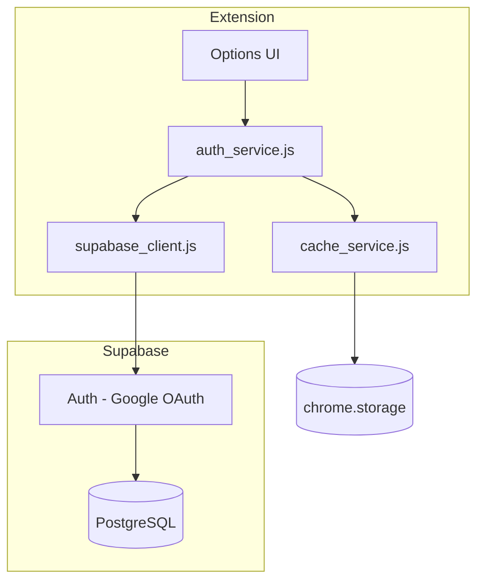

# User Authentication & Account Infrastructure Specification

**Version:** 1.0  
**Date:** 2026-02-09  
**Status:** Draft  
**Priority:** P0 (Foundation for monetization)

---

## 1. Overview

### 1.1 Purpose
Implement user authentication using **Supabase Auth (Google OAuth)**, preparing foundation for future payment integration.

### 1.2 Goals
- ✅ **Google Sign-In** - Users authenticate via Google OAuth
- ✅ **MV3 Compatible** - Works in Chrome Extension Service Workers
- ✅ **Payment Ready** - Schema supports future Pro subscriptions
- ✅ **Offline Resilient** - Cached auth state with "Remember me"
- ✅ **Multi-device** - Max 5 active sessions per account

### 1.3 Non-Goals (Phase 1)
- ❌ Email/password auth (Google only)
- ❌ Payment processing (future Phase 2)
- ❌ Feature gating (future Phase 2)

---

## 2. Architecture



---

## 3. Database Schema

### 3.1 Table: `profiles`

```sql
CREATE TABLE profiles (
  id UUID PRIMARY KEY REFERENCES auth.users(id) ON DELETE CASCADE,
  email TEXT NOT NULL,
  display_name TEXT,
  avatar_url TEXT,
  
  -- Subscription (prepared for future)
  is_pro BOOLEAN DEFAULT false,
  subscription_status TEXT DEFAULT 'free',
  subscription_end_date TIMESTAMPTZ,
  lemon_squeezy_customer_id TEXT,
  
  -- Session management
  active_sessions INTEGER DEFAULT 1,
  remember_me BOOLEAN DEFAULT true,
  
  -- Metadata
  created_at TIMESTAMPTZ DEFAULT NOW(),
  updated_at TIMESTAMPTZ DEFAULT NOW()
);

ALTER TABLE profiles ENABLE ROW LEVEL SECURITY;

-- RLS: Users can only access own profile
CREATE POLICY "Users can view own profile" ON profiles
  FOR SELECT USING (auth.uid() = id);

CREATE POLICY "Users can update own profile" ON profiles
  FOR UPDATE USING (auth.uid() = id);

-- Auto-create profile on signup
CREATE OR REPLACE FUNCTION handle_new_user()
RETURNS TRIGGER AS $$
BEGIN
  INSERT INTO public.profiles (id, email, display_name, avatar_url)
  VALUES (
    NEW.id,
    NEW.email,
    NEW.raw_user_meta_data->>'full_name',
    NEW.raw_user_meta_data->>'avatar_url'
  );
  RETURN NEW;
END;
$$ LANGUAGE plpgsql SECURITY DEFINER;

CREATE TRIGGER on_auth_user_created
  AFTER INSERT ON auth.users
  FOR EACH ROW EXECUTE FUNCTION handle_new_user();
```

---

## 4. Implementation

### 4.1 [NEW] `lib/supabase_client.js`

MV3-compatible Supabase client using `chrome.storage.local`:

```javascript
import { createClient } from '@supabase/supabase-js';
import { SUPABASE_CONFIG } from '../config/supabase_config.js';

// Custom storage adapter for Chrome Extension MV3
const chromeStorageAdapter = {
  getItem: async (key) => {
    const result = await chrome.storage.local.get(key);
    return result[key] ?? null;
  },
  setItem: async (key, value) => {
    await chrome.storage.local.set({ [key]: value });
  },
  removeItem: async (key) => {
    await chrome.storage.local.remove(key);
  }
};

export const supabase = createClient(
  SUPABASE_CONFIG.URL,
  SUPABASE_CONFIG.ANON_KEY,
  {
    auth: {
      storage: chromeStorageAdapter,
      autoRefreshToken: true,
      persistSession: true,
      detectSessionInUrl: false
    }
  }
);
```

### 4.2 [NEW] `services/auth_service.js`

```javascript
import { supabase } from '../lib/supabase_client.js';
import { cacheAuthState, clearAuthCache } from './cache_service.js';

const MAX_SESSIONS = 5;

export async function signInWithGoogle() {
  const { data, error } = await supabase.auth.signInWithOAuth({
    provider: 'google',
    options: {
      redirectTo: chrome.identity.getRedirectURL(),
      skipBrowserRedirect: true
    }
  });
  
  if (error) throw error;
  
  // Use chrome.identity for OAuth popup
  const redirectUrl = await new Promise((resolve, reject) => {
    chrome.identity.launchWebAuthFlow(
      { url: data.url, interactive: true },
      (url) => chrome.runtime.lastError 
        ? reject(new Error(chrome.runtime.lastError.message))
        : resolve(url)
    );
  });
  
  // Extract and set session
  const url = new URL(redirectUrl);
  const params = new URLSearchParams(url.hash.substring(1));
  
  const { data: session } = await supabase.auth.setSession({
    access_token: params.get('access_token'),
    refresh_token: params.get('refresh_token')
  });
  
  await cacheAuthState(session.user);
  return session;
}

export async function signOut() {
  await supabase.auth.signOut();
  await clearAuthCache();
}

export async function getAuthState(forceRefresh = false) {
  if (!forceRefresh) {
    const cached = await getCachedAuthState();
    if (cached && !cached.expired) return cached;
  }
  
  const { data: { session } } = await supabase.auth.getSession();
  if (!session) return { isAuthenticated: false };
  
  const { data: profile } = await supabase
    .from('profiles')
    .select('*')
    .eq('id', session.user.id)
    .single();
  
  const authState = {
    isAuthenticated: true,
    user: {
      id: session.user.id,
      email: session.user.email,
      displayName: session.user.user_metadata?.full_name,
      avatarUrl: session.user.user_metadata?.avatar_url
    },
    isPro: profile?.is_pro ?? false,
    rememberMe: profile?.remember_me ?? true
  };
  
  await cacheAuthState(authState);
  return authState;
}
```

### 4.3 [NEW] `services/cache_service.js`

```javascript
const CACHE_KEY = 'atom_auth_cache';
const DEFAULT_TTL = 7 * 24 * 60 * 60 * 1000; // 7 days (Remember me)
const SHORT_TTL = 24 * 60 * 60 * 1000; // 24 hours

export async function cacheAuthState(authState, rememberMe = true) {
  const ttl = rememberMe ? DEFAULT_TTL : SHORT_TTL;
  await chrome.storage.local.set({
    [CACHE_KEY]: {
      ...authState,
      cached_at: Date.now(),
      expires_at: Date.now() + ttl
    }
  });
}

export async function getCachedAuthState() {
  const result = await chrome.storage.local.get(CACHE_KEY);
  const cached = result[CACHE_KEY];
  if (!cached) return null;
  
  cached.expired = Date.now() > cached.expires_at;
  return cached;
}

export async function clearAuthCache() {
  await chrome.storage.local.remove([CACHE_KEY, 'atom_user_profile']);
}
```

---

## 5. UI Changes

### 5.1 [MODIFY] `options.html` - Add Account Tab

```html
<!-- Navigation -->
<button class="nav-tab" data-tab="account">
  <span class="nav-icon">👤</span>
  <span data-i18n="opt_tab_account">Account</span>
</button>

<!-- Account Panel -->
<div id="panel-account" class="tab-panel">
  <!-- Logged Out -->
  <div id="auth-logged-out">
    <div class="hero-box">
      <h3>Sign in to AmoNexus</h3>
      <p>Sync data across devices and unlock Pro features.</p>
      <button id="btn-google-signin" class="btn-get-key">
        🔐 Sign in with Google
      </button>
      <label class="remember-me">
        <input type="checkbox" id="rememberMe" checked>
        <span>Remember me for 7 days</span>
      </label>
    </div>
  </div>

  <!-- Logged In -->
  <div id="auth-logged-in" style="display:none">
    <div class="user-card">
      
      <div>
        <span id="user-name"></span>
        <span id="user-email"></span>
        <span id="user-plan" class="badge">Free</span>
      </div>
    </div>
    <button id="btn-signout" class="btn-action danger">
      🚪 Sign Out
    </button>
  </div>
</div>
```

### 5.2 [MODIFY] `manifest.json`

```json
{
  "permissions": [
    "identity",
    "storage",
    "tabs"
  ],
  "oauth2": {
    "client_id": "YOUR_CLIENT_ID.apps.googleusercontent.com",
    "scopes": ["openid", "email", "profile"]
  }
}
```

---

## 6. Configuration

### 6.1 [NEW] `config/supabase_config.js`

```javascript
export const SUPABASE_CONFIG = {
  URL: 'https://YOUR_PROJECT.supabase.co',
  ANON_KEY: 'YOUR_ANON_KEY'
};
```

> [!CAUTION]
> Add `config/supabase_config.js` to `.gitignore`!

### 6.2 Supabase Setup Steps
1. Create project at [supabase.com](https://supabase.com)
2. Enable Google provider in Auth settings
3. Configure Google OAuth in Google Cloud Console:
   - Redirect URI: `https://YOUR_PROJECT.supabase.co/auth/v1/callback`
   - Extension redirect: `https://<EXT_ID>.chromiumapp.org/`
4. Run SQL schema in Supabase SQL Editor

---

## 7. Implementation Plan

| Phase | Tasks | Week |
|-------|-------|------|
| **P0** | Supabase setup, DB schema, RLS | 1 |
| **P1** | `supabase_client.js`, `auth_service.js`, `cache_service.js` | 1 |
| **P2** | Options UI, manifest updates, i18n | 2 |
| **P3** | Testing, error handling, documentation | 2-3 |

---

## 8. Verification

### Manual Tests
1. **Sign-In**: Click Google → OAuth popup → Success → UI shows user info
2. **Sign-Out**: Click Sign Out → UI returns to login state, cache cleared
3. **Persistence**: Sign in → Close browser → Reopen → Still logged in
4. **Remember Me OFF**: Uncheck → Sign in → Cache expires in 24h (not 7 days)
5. **Offline**: Disconnect → Cached state still works

---

## 9. i18n Keys

| Key | EN | VI |
|-----|----|----|
| `opt_tab_account` | Account | Tài khoản |
| `opt_account_signin_google` | Sign in with Google | Đăng nhập với Google |
| `opt_account_signout` | Sign Out | Đăng xuất |
| `opt_account_remember_me` | Remember me for 7 days | Ghi nhớ đăng nhập 7 ngày |

---

**Next Step:** Approve → Setup Supabase → Implement Phase P0

